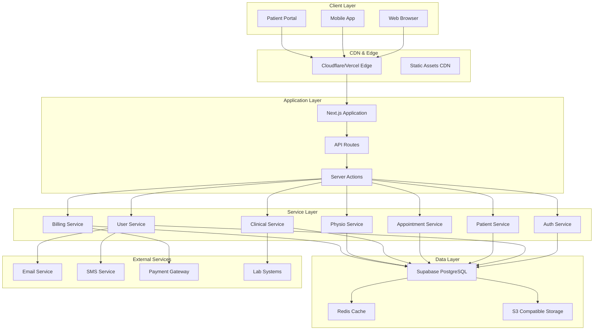
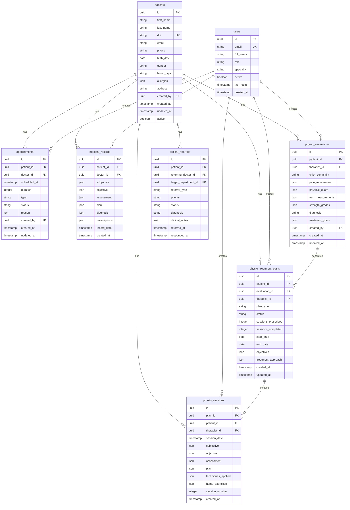
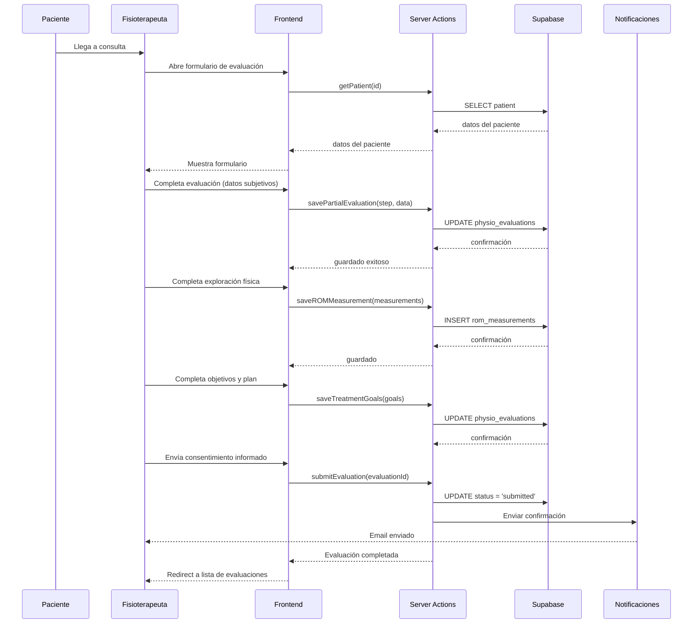
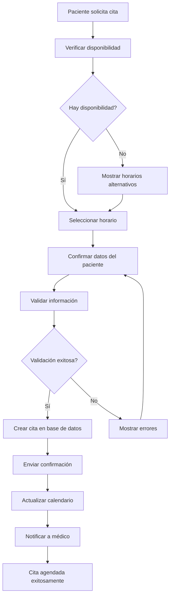
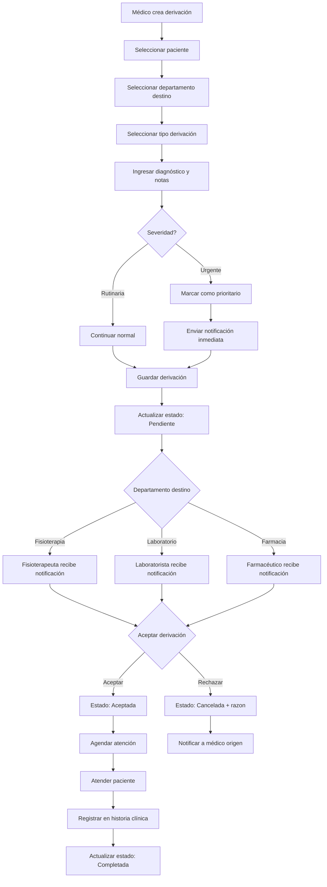
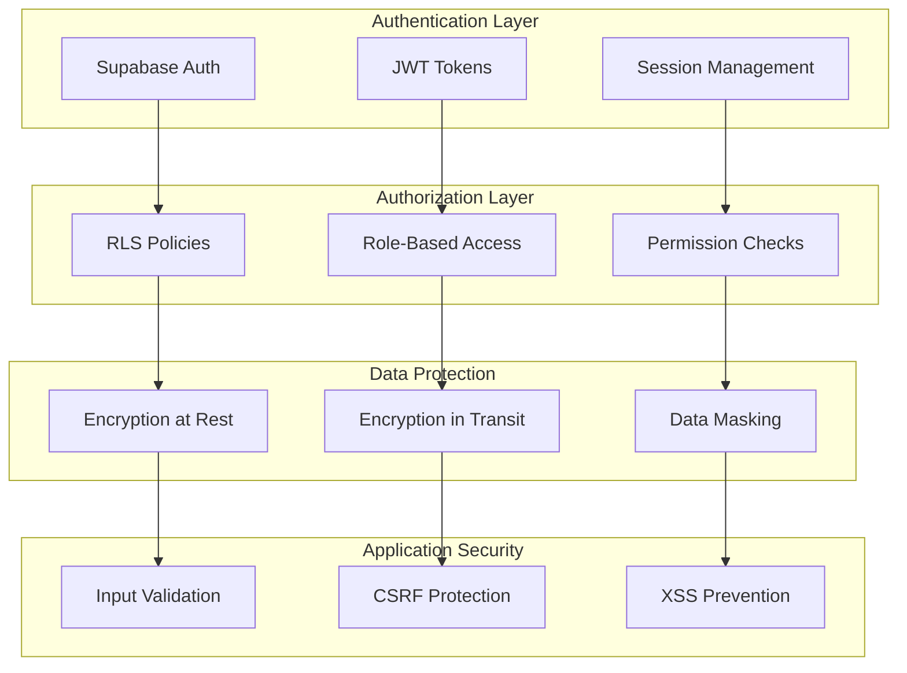

# Documentación de Arquitectura Técnica - MediCore ERP

## Tabla de Contenidos

1. [Visión General de la Arquitectura](#1-visión-general-de-la-arquitectura)
2. [Stack Tecnológico](#2-stack-tecnológico)
3. [Arquitectura de Capas](#3-arquitectura-de-capas)
4. [Estructura del Proyecto](#4-estructura-del-proyecto)
5. [Modelo de Datos](#5-modelo-de-datos)
6. [Flujos de Datos](#6-flujos-de-datos)
7. [Seguridad](#7-seguridad)
8. [Escalabilidad y Rendimiento](#8-escalabilidad-y-rendimiento)
9. [Despliegue e Infraestructura](#9-despliegue-e-infraestructura)
10. [Monitoreo y Logging](#10-monitoreo-y-logging)

---

## 1. Visión General de la Arquitectura

### 1.1 Principios de Diseño

MediCore ERP se construye sobre los siguientes principios arquitectónicos:

| Principio | Descripción | Aplicación |
|-----------|-------------|------------|
| **Modularidad** | Sistema desacoplado en módulos independientes | Cada módulo tiene su propia lógica de dominio |
| **Escalabilidad Horizontal** | Capacidad de escalar componentes individuales | Contenedores, funciones serverless |
| **Fail-Safe** | Fallo en un componente no rompe el sistema | Circuit breakers, graceful degradation |
| **Audit Trail** | Todas las operaciones quedan registradas | Tablas de auditoría, logs estructurados |
| **Data Consistency** | Consistencia eventual con opción a inmediata | PostgreSQL transactions, event sourcing |
| **API-First** | API bien definida para toda interacción | REST/GraphQL endpoints consistentes |

### 1.2 Arquitectura de Alto Nivel



### 1.3 Características Clave

```typescript
// Arquitectura de características del sistema
const architectureFeatures = {
  frontend: {
    framework: 'Next.js 14',
    rendering: ['SSR', 'CSR', 'ISR'],
    styling: 'Tailwind CSS',
    stateManagement: ['React Context', 'Zustand', 'React Query'],
    typeSafety: 'TypeScript strict mode'
  },
  
  backend: {
    runtime: 'Node.js (Next.js API Routes)',
    architecture: 'Serverless Functions',
    apiStyle: 'REST',
    validation: 'Zod',
    documentation: 'OpenAPI/Swagger'
  },
  
  database: {
    engine: 'PostgreSQL',
    orm: 'Supabase JS Client',
    migrations: 'Supabase Migrations',
    realtime: 'Supabase Realtime'
  },
  
  authentication: {
    provider: 'Supabase Auth',
    methods: ['Email/Password', 'OAuth', 'MFA'],
    sessions: 'JWT',
    rbac: 'Role-Based Access Control'
  },
  
  infrastructure: {
    hosting: 'Vercel/Netlify',
    database: 'Supabase Cloud',
    cdn: 'Vercel Edge Network',
    ciCd: 'GitHub Actions'
  }
};
```

---

## 2. Stack Tecnológico

### 2.1 Tecnologías por Capa

| Capa | Tecnología | Versión | Justificación |
|------|------------|---------|---------------|
| **Frontend** | Next.js | 14.x | App Router, Server Components |
| **Framework UI** | React | 18.x | Concurrent features |
| **Lenguaje** | TypeScript | 5.x | Type safety |
| **Estilos** | Tailwind CSS | 3.x | Utility-first, responsive |
| **Componentes** | shadcn/ui | Latest | Accesibles, customizables |
| **Formularios** | React Hook Form | 7.x | Performance, validation |
| **Validación** | Zod | Latest | Schema validation |
| **Data Fetching** | TanStack Query | 5.x | Caching, sync |
| **Estado** | Zustand | Latest | Simple, performant |
| **Database** | PostgreSQL | 15.x | Relational, ACID |
| **ORM** | Supabase JS | 2.x | Type-safe queries |
| **Auth** | Supabase Auth | Built-in | JWT, OAuth |
| **Realtime** | Supabase Realtime | Built-in | WebSocket subscriptions |
| **Deployment** | Vercel | Latest | Edge functions |
| **Version Control** | Git | Latest | Collaboration |

### 2.2 Herramientas de Desarrollo

```json
{
  "devDependencies": {
    "typescript": "^5.0.0",
    "eslint": "^8.0.0",
    "prettier": "^3.0.0",
    "husky": "^8.0.0",
    "lint-staged": "^14.0.0",
    "jest": "^29.0.0",
    "testing-library/react": "^14.0.0",
    "cypress": "^13.0.0"
  }
}
```

---

## 3. Arquitectura de Capas

### 3.1 Capas del Sistema

```
┌─────────────────────────────────────────────────────────────────┐
│                      CAPA DE PRESENTACIÓN                        │
│  ┌───────────────────────────────────────────────────────────┐  │
│  │  Pages & Routes          Components        Hooks          │  │
│  │  • App Router            • UI Components  • useAuth       │  │
│  │  • Route Groups          • Feature Components • useData   │  │
│  │  • Dynamic Routes        • Layouts         • useForm      │  │
│  └───────────────────────────────────────────────────────────┘  │
├─────────────────────────────────────────────────────────────────┤
│                        CAPA DE SERVICIOS                         │
│  ┌───────────────────────────────────────────────────────────┐  │
│  │  Server Actions           API Routes        Services       │  │
│  │  • Patient Actions        • REST Endpoints  • AuthService │  │
│  │  • Appointment Actions    • Webhooks        • EmailService│  │
│  │  • Clinical Actions       • Middleware      • PaymentSvc  │  │
│  └───────────────────────────────────────────────────────────┘  │
├─────────────────────────────────────────────────────────────────┤
│                      CAPA DE DOMINIO                             │
│  ┌───────────────────────────────────────────────────────────┐  │
│  │  Types & Interfaces      Validators      Utilities        │  │
│  │  • Patient               • Zod Schemas   • Formatters     │  │
│  │  • Appointment           • Custom Rules  • Calculators    │  │
│  │  • Clinical Record       • Type Guards   • Constants      │  │
│  └───────────────────────────────────────────────────────────┘  │
├─────────────────────────────────────────────────────────────────┤
│                        CAPA DE DATOS                             │
│  ┌───────────────────────────────────────────────────────────┐  │
│  │  Database Client         Supabase        Cache            │  │
│  │  • createClient          • Queries       • Redis          │  │
│  │  • Pool management       • Mutations     • React Query    │  │
│  │  • Type inference        • Realtime      • SWR            │  │
│  └───────────────────────────────────────────────────────────┘  │
└─────────────────────────────────────────────────────────────────┘
```

### 3.2 Flujo de Datos entre Capas

```typescript
// Flujo de datos típico en MediCore ERP

// 1. Presentación: Componente de UI
function PatientForm() {
  const form = useForm({
    resolver: zodResolver(patientSchema),
    defaultValues: { name: '', dni: '' }
  });
  
  const onSubmit = async (data: PatientInput) => {
    // 2. Capa de Dominio: Validación ya realizada por Zod
    await createPatientAction(data); // 3. Server Action
  };
  
  return <Form {...form} />;
}

// 2. Server Action: Capa de Servicios
'use server'
async function createPatientAction(data: PatientInput) {
  // Validación adicional
  validatePatientInput(data);
  
  // 4. Capa de Datos: Mutación a base de datos
  const { data: patient, error } = await supabase
    .from('patients')
    .insert(patientToDb(data))
    .select()
    .single();
    
  if (error) throw new PatientCreationError(error);
  
  // 5. Invalidar caché
  await revalidatePath('/patients');
  
  return patient;
}
```

---

## 4. Estructura del Proyecto

### 4.1 Organización de Directorios

```
medicore-erp/
├── app/                          # Next.js App Router
│   ├── (auth)/                   # Route group: Auth pages
│   │   ├── login/
│   │   │   ├── page.tsx          # Login page
│   │   │   └── layout.tsx        # Auth layout
│   │   └── layout.tsx            # Auth root layout
│   │
│   ├── (dashboard)/              # Route group: Protected routes
│   │   ├── dashboard/
│   │   │   ├── patients/         # Patients module
│   │   │   │   ├── page.tsx      # List view
│   │   │   │   ├── new/          # Create patient
│   │   │   │   │   └── page.tsx
│   │   │   │   └── [id]/         # Patient detail
│   │   │   │       └── page.tsx
│   │   │   ├── appointments/     # Appointments module
│   │   │   ├── physiotherapy/    # Physiotherapy module
│   │   │   ├── pharmacy/         # Pharmacy module
│   │   │   ├── lab/              # Lab module
│   │   │   └── billing/          # Billing module
│   │   │
│   │   ├── layout.tsx            # Dashboard layout
│   │   └── page.tsx              # Dashboard home
│   │
│   └── api/                      # API Routes
│       ├── appointments/
│       ├── patients/
│       ├── physio/
│       └── auth/
│
├── components/                   # Reusable components
│   ├── ui/                       # Base UI components
│   │   ├── Button.tsx
│   │   ├── Card.tsx
│   │   ├── Input.tsx
│   │   ├── Select.tsx
│   │   └── Modal.tsx
│   │
│   ├── physio/                   # Physiotherapy components
│   │   ├── VASScale.tsx
│   │   ├── StrengthGrade.tsx
│   │   ├── ROMMeasurement.tsx
│   │   ├── FunctionalEvolution.tsx
│   │   └── index.ts
│   │
│   ├── discharge/                # Discharge components
│   │   └── PhysioDischargeSummary.tsx
│   │
│   └── shared/                   # Shared components
│       ├── PatientSelector.tsx
│       └── AppointmentForm.tsx
│
├── lib/                          # Utilities and configurations
│   ├── supabase/                 # Supabase client
│   │   ├── client.ts
│   │   ├── server.ts
│   │   └── middleware.ts
│   │
│   ├── types/                    # TypeScript definitions
│   │   ├── patient.ts
│   │   ├── appointment.ts
│   │   └── physiotherapy.ts
│   │
│   ├── utils/                    # Utility functions
│   │   ├── formatters.ts
│   │   ├── validators.ts
│   │   └── constants.ts
│   │
│   └── hooks/                    # Custom React hooks
│       ├── useAuth.ts
│       └── usePatients.ts
│
├── public/                       # Static assets
│   ├── images/
│   └── locales/
│
├── docs/                         # Documentation
├── supabase/                     # Supabase configuration
│   ├── migrations/
│   ├── seed.sql
│   └── config.toml
│
├── .env.example                  # Environment variables template
├── next.config.js                # Next.js configuration
├── tailwind.config.js            # Tailwind CSS configuration
├── tsconfig.json                 # TypeScript configuration
└── package.json
```

### 4.2 Convenciones de Código

```typescript
// Naming Conventions

// 1. Archivos: kebab-case
// patient-form.tsx
// appointment-list.tsx

// 2. Componentes: PascalCase
const PatientForm: React.FC<PatientFormProps> = () => {};

// 3. Hooks: camelCase con prefijo use
function usePatients(filter: PatientFilter) {}

// 4. Funciones utilitarias: camelCase
function formatDate(date: Date): string {}

// 5. Constantes: SCREAMING_SNAKE_CASE
const MAX_PATIENTS_PER_PAGE = 50;

// 6. Tipos: PascalCase con sufijo
interface Patient {}
type PatientInput = Omit<Patient, 'id'>;

// 7. Props: camelCase con prefijo del componente
interface PatientCardProps {
  patient: Patient;
  onEdit?: () => void;
}
```

---

## 5. Modelo de Datos

### 5.1 Entidades Principales



### 5.2 Definiciones de Tipos TypeScript

```typescript
// lib/types/patient.ts
export interface Patient {
  id: string;
  firstName: string;
  lastName: string;
  dni: string;
  email: string;
  phone: string;
  birthDate: Date;
  gender: 'male' | 'female' | 'other';
  bloodType?: BloodType;
  allergies: string[];
  medicalHistory: MedicalHistory;
  emergencyContact?: EmergencyContact;
  insurance?: Insurance;
  createdAt: Date;
  updatedAt: Date;
  active: boolean;
}

export type BloodType = 'A+' | 'A-' | 'B+' | 'B-' | 'AB+' | 'AB-' | 'O+' | 'O-';

export interface MedicalHistory {
  surgeries: Surgery[];
  conditions: string[];
  medications: string[];
  familyHistory: string[];
}

export interface Surgery {
  name: string;
  date: Date;
  notes?: string;
}

// lib/types/physiotherapy.ts
export interface PhysioEvaluation {
  id: string;
  patientId: string;
  therapistId: string;
  chiefComplaint: string;
  painAssessment: PainAssessment;
  physicalExamination: PhysicalExamination;
  romMeasurements: ROMMeasurement[];
  strengthGrades: StrengthGrade[];
  diagnosis: string;
  icd10Code?: string;
  shortTermGoals: string[];
  longTermGoals: string[];
  treatmentPlan?: string;
  informedConsent: boolean;
  consentDate?: Date;
  createdAt: Date;
  updatedAt: Date;
}

export interface PainAssessment {
  vasScore: number; // 0-10
  painLocation: string;
  painDuration: string;
  painType: 'acute' | 'chronic' | 'acute_on_chronic';
  painQuality: string[];
  aggravatingFactors: string[];
  relievingFactors: string[];
}

export interface ROMMeasurement {
  joint: string;
  movement: string;
  side: 'left' | 'right' | 'bilateral';
  activeROM: number;
  passiveROM: number;
  unit: 'degrees';
  notes?: string;
}

export interface StrengthGrade {
  muscle: string;
  side: 'left' | 'right' | 'bilateral';
  grade: 0 | 1 | 2 | 3 | 4 | 5;
  notes?: string;
}

// lib/types/appointment.ts
export interface Appointment {
  id: string;
  patientId: string;
  doctorId: string;
  scheduledAt: Date;
  duration: number; // minutes
  type: AppointmentType;
  status: AppointmentStatus;
  reason: string;
  notes?: string;
  createdAt: Date;
  updatedAt: Date;
}

export type AppointmentType = 
  | 'consultation'
  | 'follow_up'
  | 'procedure'
  | 'emergency'
  | 'physiotherapy'
  | 'lab';

export type AppointmentStatus = 
  | 'scheduled'
  | 'confirmed'
  | 'in_progress'
  | 'completed'
  | 'cancelled'
  | 'no_show';
```

---

## 6. Flujos de Datos

### 6.1 Flujo de Creación de Evaluación de Fisioterapia



### 6.2 Flujo de Agendamiento de Citas



### 6.3 Flujo de Derivaciones Clínicas



### 6.4 Flujo de Datos en Tiempo Real

```typescript
// Supabase Realtime - Suscripciones en MediCore ERP

// 1. Suscripción a cambios en citas del día
function useTodayAppointments() {
  return useQuery({
    queryKey: ['appointments', 'today'],
    queryFn: async () => {
      const { data } = await supabase
        .from('appointments')
        .select('*, patient:patients(*)')
        .eq('date', today)
        .order('scheduled_at');
      return data;
    }
  });
}

// 2. Suscripción en tiempo real a actualizaciones
function useRealtimeAppointments() {
  const queryClient = useQueryClient();
  
  useEffect(() => {
    const channel = supabase
      .channel('appointments_changes')
      .on(
        'postgres_changes',
        {
          event: '*',
          schema: 'public',
          table: 'appointments'
        },
        (payload) => {
          // Invalidar caché para refrescar datos
          queryClient.invalidateQueries(['appointments']);
          
          // Mostrar notificación para cambios relevantes
          if (payload.eventType === 'UPDATE') {
            showNotification('Cita actualizada', 'info');
          }
        }
      )
      .subscribe();
      
    return () => {
      supabase.removeChannel(channel);
    };
  }, [queryClient]);
}
```

---

## 7. Seguridad

### 7.1 Modelo de Seguridad



### 7.2 Row Level Security (RLS)

```sql
-- Supabase RLS Policies

-- Enable RLS on patients table
ALTER TABLE patients ENABLE ROW LEVEL SECURITY;

-- Policy: Users can only see their organization's patients
CREATE POLICY "Users can view patients" ON patients
  FOR SELECT
  USING (
    organization_id IN (
      SELECT organization_id FROM user_organizations
      WHERE user_id = auth.uid()
    )
  );

-- Policy: Only owner can create patients
CREATE POLICY "Users can create patients" ON patients
  FOR INSERT
  WITH CHECK (
    auth.uid() IN (
      SELECT user_id FROM user_organizations
      WHERE organization_id = organization_id
    )
  );

-- Policy: Only owner can update own records
CREATE POLICY "Users can update own patients" ON patients
  FOR UPDATE
  USING (
    created_by = auth.uid()
  );

-- Policy: Admins can do everything
CREATE POLICY "Admins can do everything" ON patients
  FOR ALL
  USING (
    EXISTS (
      SELECT 1 FROM user_roles
      WHERE user_id = auth.uid()
      AND role = 'admin'
    )
  );
```

### 7.3 Control de Acceso por Roles

```typescript
// lib/auth/permissions.ts

export type Role = 'admin' | 'doctor' | 'nurse' | 'physio' | 'receptionist' | 'pharmacist' | 'lab_tech' | 'billing';

export const permissions: Record<Role, string[]> = {
  admin: ['*'],
  doctor: [
    'patients:read', 'patients:write',
    'appointments:read', 'appointments:write',
    'records:read', 'records:write',
    'physio:read',
    'lab:read', 'lab:write',
    'billing:read'
  ],
  nurse: [
    'patients:read',
    'appointments:read',
    'records:read', 'records:write',
    'vitals:read', 'vitals:write'
  ],
  physio: [
    'patients:read',
    'physio:read', 'physio:write',
    'appointments:read', 'appointments:write'
  ],
  receptionist: [
    'patients:read', 'patients:write',
    'appointments:read', 'appointments:write'
  ],
  pharmacist: [
    'patients:read',
    'pharmacy:read', 'pharmacy:write',
    'prescriptions:read'
  ],
  lab_tech: [
    'patients:read',
    'lab:read', 'lab:write',
    'orders:read', 'orders:write'
  ],
  billing: [
    'patients:read',
    'billing:read', 'billing:write',
    'payments:read', 'payments:write'
  ]
};

export function hasPermission(role: Role, permission: string): boolean {
  const rolePermissions = permissions[role];
  return rolePermissions.includes('*') || rolePermissions.includes(permission);
}

export function checkPermission(permission: string): void {
  const session = getSession();
  if (!session) {
    throw new Error('Unauthorized: No session');
  }
  
  if (!hasPermission(session.user.role, permission)) {
    throw new Error('Forbidden: Insufficient permissions');
  }
}
```

### 7.4 Validación de Entrada

```typescript
// lib/validators/patient.ts
import { z } from 'zod';

export const patientSchema = z.object({
  firstName: z
    .string()
    .min(2, 'El nombre debe tener al menos 2 caracteres')
    .max(50, 'El nombre no puede exceder 50 caracteres')
    .regex(/^[a-zA-Z\s]+$/, 'El nombre solo puede contener letras'),
    
  lastName: z
    .string()
    .min(2, 'El apellido debe tener al menos 2 caracteres')
    .max(50, 'El apellido no puede exceder 50 caracteres'),
    
  dni: z
    .string()
    .min(8, 'El DNI debe tener al menos 8 dígitos')
    .max(11, 'El DNI no puede exceder 11 dígitos')
    .regex(/^\d+$/, 'El DNI solo puede contener números'),
    
  email: z
    .string()
    .email('Correo electrónico inválido')
    .optional()
    .or(z.literal('')),
    
  phone: z
    .string()
    .regex(/^\d{10}$/, 'El teléfono debe tener 10 dígitos')
    .optional(),
    
  birthDate: z
    .date()
    .max(new Date(), 'La fecha de nacimiento no puede ser futura')
    .refine(
      (date) => {
        const age = new Date().getFullYear() - date.getFullYear();
        return age >= 0 && age <= 150;
      },
      'Edad inválida'
    ),
    
  gender: z.enum(['male', 'female', 'other']),
  
  bloodType: z
    .enum(['A+', 'A-', 'B+', 'B-', 'AB+', 'AB-', 'O+', 'O-'])
    .optional(),
    
  allergies: z.array(z.string()).optional(),
  
  address: z
    .string()
    .max(200, 'La dirección no puede exceder 200 caracteres')
    .optional()
});

export type PatientInput = z.infer<typeof patientSchema>;

// lib/validators/physiotherapy.ts
export const painAssessmentSchema = z.object({
  vasScore: z.number().min(0).max(10),
  painLocation: z.string().min(1, 'Ubicación del dolor requerida'),
  painDuration: z.string().min(1, 'Duración del dolor requerida'),
  painType: z.enum(['acute', 'chronic', 'acute_on_chronic']),
  painQuality: z.array(z.string()).optional(),
  aggravatingFactors: z.array(z.string()).optional(),
  relievingFactors: z.array(z.string()).optional()
});

export const romMeasurementSchema = z.object({
  joint: z.string().min(1, 'Articulación requerida'),
  movement: z.string().min(1, 'Movimiento requerido'),
  side: z.enum(['left', 'right', 'bilateral']),
  activeROM: z.number().min(0).max(360),
  passiveROM: z.number().min(0).max(360),
  unit: z.literal('degrees'),
  notes: z.string().optional()
});

export const strengthGradeSchema = z.object({
  muscle: z.string().min(1, 'Músculo requerido'),
  side: z.enum(['left', 'right', 'bilateral']),
  grade: z.number().min(0).max(5),
  notes: z.string().optional()
});
```

---

## 8. Escalabilidad y Rendimiento

### 8.1 Estrategias de Optimización

```typescript
// 1. Server Components para reducir bundle size
// app/patients/page.tsx - Server Component por defecto
async function PatientsPage() {
  // Esta consulta se ejecuta en el servidor
  const patients = await getPatients();
  
  return (
    <div>
      <h1>Patients</h1>
      <PatientList patients={patients} />
    </div>
  );
}

// 2. Streaming con Suspense
// app/dashboard/page.tsx
import { Suspense } from 'react';

function DashboardPage() {
  return (
    <div>
      <h1>Dashboard</h1>
      <Suspense fallback={<StatsSkeleton />}>
        <StatsCards />
      </Suspense>
      <Suspense fallback={<AppointmentsSkeleton />}>
        <TodayAppointments />
      </Suspense>
    </div>
  );
}

// 3. Caching con React Query
function usePatients() {
  return useQuery({
    queryKey: ['patients'],
    queryFn: fetchPatients,
    staleTime: 5 * 60 * 1000, // 5 minutos
    gcTime: 30 * 60 * 1000, // 30 minutos
    refetchOnWindowFocus: false
  });
}

// 4. Infinite scrolling
function useInfiniteAppointments() {
  return useInfiniteQuery({
    queryKey: ['appointments', 'infinite'],
    queryFn: fetchAppointments,
    initialPageParam: 0,
    getNextPageParam: (lastPage) => lastPage.nextCursor
  });
}
```

### 8.2 Índices de Base de Datos

```sql
-- Índices para optimización de consultas frecuentes

-- Citas por fecha y estado
CREATE INDEX idx_appointments_date_status 
ON appointments(scheduled_at, status) 
WHERE status != 'cancelled';

-- Pacientes por DNI (búsqueda frecuente)
CREATE INDEX idx_patients_dni 
ON patients(dni);

-- Evaluaciones por paciente
CREATE INDEX idx_physio_evaluations_patient 
ON physio_evaluations(patient_id, created_at DESC);

-- Planes de tratamiento activos
CREATE INDEX idx_physio_treatment_plans_status 
ON physio_treatment_plans(status) 
WHERE status = 'active';

-- Historial médico por fecha
CREATE INDEX idx_medical_records_patient_date 
ON medical_records(patient_id, record_date DESC);

-- Derivaciones pendientes
CREATE INDEX idx_clinical_referrals_status 
ON clinical_referrals(status, created_at DESC) 
WHERE status = 'pending';

-- Búsqueda de texto completo en notas
ALTER TABLE medical_records 
ADD COLUMN search_vector tsvector;

CREATE INDEX idx_medical_records_search 
ON medical_records USING GIN(search_vector);

UPDATE medical_records 
SET search_vector = 
  to_tsvector('spanish', 
    COALESCE(subjective->>'chiefComplaint', '') || ' ' ||
    COALESCE(assessment, '')
  );
```

### 8.3 Particionamiento de Tablas

```sql
-- Particionamiento por fecha para tablas grandes

-- Tabla de citas particionada por mes
CREATE TABLE appointments (
    id UUID NOT NULL,
    patient_id UUID NOT NULL,
    doctor_id UUID NOT NULL,
    scheduled_at TIMESTAMP NOT NULL,
    status TEXT NOT NULL,
    PRIMARY KEY (id, scheduled_at)
) PARTITION BY RANGE (scheduled_at);

-- Crear particiones para el año actual
CREATE TABLE appointments_2025_01 PARTITION OF appointments
    FOR VALUES FROM ('2025-01-01') TO ('2025-02-01');

CREATE TABLE appointments_2025_02 PARTITION OF appointments
    FOR VALUES FROM ('2025-02-01') TO ('2025-03-01');

-- ... crear particiones para cada mes

-- Crear partición default para datos históricos
CREATE TABLE appointments_default PARTITION OF appointments DEFAULT;

-- Función para crear particiones automáticamente
CREATE OR REPLACE FUNCTION create_appointment_partition()
RETURNS TRIGGER AS $$
DECLARE
    partition_name TEXT;
    partition_start DATE;
    partition_end DATE;
BEGIN
    partition_start := DATE_TRUNC('month', NEW.scheduled_at::date);
    partition_end := partition_start + INTERVAL '1 month';
    partition_name := 'appointments_' || TO_CHAR(partition_start, 'YYYY_MM');
    
    IF NOT EXISTS (
        SELECT 1 FROM pg_class c
        JOIN pg_namespace n ON n.oid = c.relnamespace
        WHERE c.relname = partition_name
    ) THEN
        EXECUTE format(
            'CREATE TABLE %I PARTITION OF appointments FOR VALUES FROM (%L) TO (%L)',
            partition_name, partition_start, partition_end
        );
    END IF;
    
    RETURN NEW;
END;
$$ LANGUAGE plpgsql;

CREATE TRIGGER create_appointment_partition_trigger
BEFORE INSERT ON appointments
FOR EACH ROW EXECUTE FUNCTION create_appointment_partition();
```

---

## 9. Despliegue e Infraestructura

### 9.1 Pipeline de CI/CD

```yaml
# .github/workflows/ci-cd.yml

name: CI/CD Pipeline

on:
  push:
    branches: [main, develop]
  pull_request:
    branches: [main]

jobs:
  lint-and-test:
    runs-on: ubuntu-latest
    steps:
      - uses: actions/checkout@v4
      
      - name: Setup Node.js
        uses: actions/setup-node@v4
        with:
          node-version: '20'
          cache: 'npm'
      
      - name: Install dependencies
        run: npm ci
      
      - name: Run linting
        run: npm run lint
      
      - name: Run type check
        run: npm run type-check
      
      - name: Run unit tests
        run: npm run test:coverage
      
      - name: Run e2e tests
        run: npm run test:e2e

  build:
    needs: lint-and-test
    runs-on: ubuntu-latest
    steps:
      - uses: actions/checkout@v4
      
      - name: Setup Node.js
        uses: actions/setup-node@v4
        with:
          node-version: '20'
          cache: 'npm'
      
      - name: Install dependencies
        run: npm ci
      
      - name: Build application
        run: npm run build
        env:
          NEXT_PUBLIC_SUPABASE_URL: ${{ secrets.SUPABASE_URL }}
          NEXT_PUBLIC_SUPABASE_ANON_KEY: ${{ secrets.SUPABASE_ANON_KEY }}

  deploy-preview:
    needs: build
    runs-on: ubuntu-latest
    if: github.event_name == 'pull_request'
    steps:
      - name: Deploy to Vercel Preview
        uses: amondnet/vercel-action@v25
        with:
          vercel-token: ${{ secrets.VERCEL_TOKEN }}
          vercel-org-id: ${{ secrets.VERCEL_ORG_ID }}
          vercel-project-id: ${{ secrets.VERCEL_PROJECT_ID }}
          vercel-args: '--prod=false'

  deploy-production:
    needs: build
    runs-on: ubuntu-latest
    if: github.ref == 'refs/heads/main'
    environment: production
    steps:
      - name: Deploy to Vercel Production
        uses: amondnet/vercel-action@v25
        with:
          vercel-token: ${{ secrets.VERCEL_TOKEN }}
          vercel-org-id: ${{ secrets.VERCEL_ORG_ID }}
          vercel-project-id: ${{ secrets.VERCEL_PROJECT_ID }}
          vercel-args: '--prod'
```

### 9.2 Configuración de Entornos

```typescript
// Entornos de despliegue

const environments = {
  development: {
    name: 'Development',
    url: 'https://dev.medicore.com',
    supabaseUrl: process.env.DEV_SUPABASE_URL,
    supabaseKey: process.env.DEV_SUPABASE_ANON_KEY,
    features: ['debug', 'logging', 'mockPayments'],
    monitoring: {
      level: 'debug',
      sentry: false
    }
  },
  
  staging: {
    name: 'Staging',
    url: 'https://staging.medicore.com',
    supabaseUrl: process.env.STAGING_SUPABASE_URL,
    supabaseKey: process.env.STAGING_SUPABASE_ANON_KEY,
    features: ['debug', 'logging'],
    monitoring: {
      level: 'info',
      sentry: true
    }
  },
  
  production: {
    name: 'Production',
    url: 'https://app.medicore.com',
    supabaseUrl: process.env.PROD_SUPABASE_URL,
    supabaseKey: process.env.PROD_SUPABASE_ANON_KEY,
    features: [],
    monitoring: {
      level: 'error',
      sentry: true,
      datadog: true
    }
  }
};
```

### 9.3 Dockerfile (Opcional)

```dockerfile
# Dockerfile para despliegue alternativo
FROM node:20-alpine AS base

# Install dependencies only when needed
FROM base AS deps
WORKDIR /app
COPY package.json package-lock.json* ./
RUN npm ci

# Rebuild the source code only when needed
FROM base AS builder
WORKDIR /app
COPY --from=deps /app/node_modules ./node_modules
COPY . .
ENV NEXT_TELEMETRY_DISABLED=1
RUN npm run build

# Production image, copy all the files and run next
FROM base AS runner
WORKDIR /app
ENV NODE_ENV=production
ENV NEXT_TELEMETRY_DISABLED=1

RUN addgroup --system --gid 1001 nodejs
RUN adduser --system --uid 1001 nextjs

COPY --from=builder /app/public ./public
COPY --from=builder --chown=nextjs:nodejs /app/.next/standalone ./
COPY --from=builder --chown=nextjs:nodejs /app/.next/static ./.next/static

USER nextjs

EXPOSE 3000
ENV PORT=3000

CMD ["node", "server.js"]
```

---

## 10. Monitoreo y Logging

### 10.1 Estructura de Logs

```typescript
// lib/utils/logger.ts

type LogLevel = 'debug' | 'info' | 'warn' | 'error';

interface LogEntry {
  timestamp: string;
  level: LogLevel;
  message: string;
  context?: Record<string, unknown>;
  userId?: string;
  requestId?: string;
}

class Logger {
  private context: string;
  
  constructor(context: string) {
    this.context = context;
  }
  
  private log(level: LogLevel, message: string, context?: Record<string, unknown>) {
    const entry: LogEntry = {
      timestamp: new Date().toISOString(),
      level,
      message,
      context: {
        ...context,
        context: this.context
      }
    };
    
    // Console output en desarrollo
    if (process.env.NODE_ENV === 'development') {
      console[level](`[${entry.timestamp}] [${level.toUpperCase()}] [${this.context}]: ${message}`, context);
    }
    
    // Enviar a servicio de logging en producción
    if (process.env.NODE_ENV === 'production') {
      // Integrar con Datadog, Sentry, etc.
      this.sendToLoggingService(entry);
    }
  }
  
  debug(message: string, context?: Record<string, unknown>) {
    this.log('debug', message, context);
  }
  
  info(message: string, context?: Record<string, unknown>) {
    this.log('info', message, context);
  }
  
  warn(message: string, context?: Record<string, unknown>) {
    this.log('warn', message, context);
  }
  
  error(message: string, error?: Error, context?: Record<string, unknown>) {
    this.log('error', message, {
      ...context,
      errorMessage: error?.message,
      errorStack: error?.stack,
      errorName: error?.name
    });
  }
  
  private async sendToLoggingService(entry: LogEntry) {
    // Implementar envío a servicio de logging
    // fetch('/api/logs', { method: 'POST', body: JSON.stringify(entry) });
  }
}

export const createLogger = (context: string) => new Logger(context);

export const logger = createLogger('MediCore');
```

### 10.2 Métricas de Rendimiento

```typescript
// lib/monitoring/performance.ts

interface PerformanceMetrics {
  pageLoadTime: number;
  ttfb: number;
  fcp: number;
  lcp: number;
  fid: number;
  cls: number;
}

// Web Vitals monitoring
export function reportWebVitals(metric: PerformanceMetrics) {
  const body = {
    name: metric.name,
    value: metric.value,
    rating: metric.rating,
    delta: metric.delta,
    id: metric.id
  };
  
  // Enviar a analytics
  fetch('/api/analytics/vitals', {
    method: 'POST',
    headers: { 'Content-Type': 'application/json' },
    body: JSON.stringify(body)
  });
}

// Custom performance tracking
export function trackCustomEvent(name: string, properties: Record<string, unknown>) {
  const event = {
    name,
    properties,
    timestamp: new Date().toISOString()
  };
  
  // Enviar a analytics
  fetch('/api/analytics/events', {
    method: 'POST',
    headers: { 'Content-Type': 'application/json' },
    body: JSON.stringify(event)
  });
}

// API response time tracking
export function trackApiCall(endpoint: string, duration: number, status: number) {
  const event = {
    name: 'api_call',
    properties: {
      endpoint,
      duration_ms: duration,
      status_code: status
    }
  };
  
  console.log(`[API] ${endpoint} - ${duration}ms - ${status}`);
}
```

### 10.3 Alertas y Sentry Integration

```typescript
// lib/monitoring/sentry.ts

import * as Sentry from '@sentry/nextjs';

Sentry.init({
  dsn: process.env.NEXT_PUBLIC_SENTRY_DSN,
  environment: process.env.NODE_ENV,
  
  // Configurar nivel de detalle
  tracesSampleRate: 1.0,
  
  // Configurar qué errores capturar
  beforeSend(event, hint) {
    const error = hint.originalException;
    
    // Ignorar ciertos errores
    if (error instanceof ValidationError) {
      return null; // No reportar errores de validación
    }
    
    return event;
  },
  
  // Agregar contexto adicional
  initialScope: {
    tags: {
      component: 'frontend'
    }
  }
});

// Error boundary component
export function ErrorBoundary({ children }: { children: React.ReactNode }) {
  return (
    <Sentry.ErrorBoundary
      fallback={({ error, resetError }) => (
        <ErrorPage
          error={error}
          onReset={() => {
            resetError();
            window.location.href = '/';
          }}
        />
      )}
    >
      {children}
    </Sentry.ErrorBoundary>
  );
}
```

---

**Fin del Documento de Arquitectura Técnica**

*Documento creado: Enero 2025*  
*Última actualización: Enero 2025*  
*Próxima revisión: Abril 2025*
