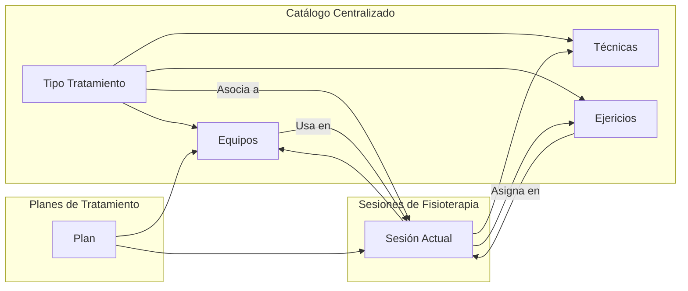

# Fases de Desarrollo: Sesiones de Fisioterapia Mejoradas

## Resumen Ejecutivo

Este documento define el plan de desarrollo por fases para mejorar el sistema de **Sesiones de Fisioterapia** con un modelo SOAP completo, integración completa de equipamiento profesional, y seguimiento de progreso del paciente.

**Principio Fundamental:** El catálogo centralizado (`/dashboard/physiotherapy/catalogs`) es la fuente única de verdad para técnicas, equipos y ejercicios. Las sesiones consumen estos datos, no los duplican.

---

## 1. Arquitectura del Sistema

### 1.1 Flujo de Datos del Catálogo a Sesiones



### 1.2 Estructura de una Sesión con Equipamiento

```
Sesión de Fisioterapia (sessions/new/page.tsx)
│
├── Sección 1: Datos Generales
│   ├── Fecha, Hora, Duración
│   └── Tipo de Tratamiento (del catálogo)
│
├── Sección 2: Subjetivo (S) - Datos del Paciente
│   ├── Dolor actual (VAS 0-10)
│   ├── Reporte del paciente
│   └── Adherencia a ejercicios en casa
│
├── Sección 3: Objetivo (O) - Evaluación Física
│   ├── Examen físico
│   ├── ROM - Rangos de Movimiento (con goniómetro)
│   ├── Fuerza muscular (escala 0-5)
│   └── Evaluación funcional
│
├── Sección 4: Análisis (A) - Interpretación
│   ├── Interpretación clínica
│   ├── Progreso vs sesión anterior
│   └── Comparativa de métricas
│
├── Sección 5: Plan (P) - Tratamiento
│   ├── Próximos pasos
│   ├── Ejercicios para casa (del catálogo)
│   └── Notas adicionales
│
├── Sección 6: TRATAMIENTOS APLICADOS
│   ├── Tipo de Tratamiento (seleccionado del catálogo)
│   │   ├── TÉCNICAS APLICADAS
│   │   │   ├── Técnica (del catálogo)
│   │   │   ├── Parámetros utilizados
│   │   │   └── Duración
│   │   │
│   │   ├── EQUIPOS UTILIZADOS
│   │   │   ├── Equipo (del catálogo - estado: disponible)
│   │   │   ├── Parámetros configurados
│   │   │   ├── Tiempo de uso
│   │   │   └── Resultados obtenidos
│   │   │
│   │   └── EJERCICIOS REALIZADOS
│   │       ├── Ejercicio (del catálogo)
│   │       ├── Series x Repeticiones
│   │       └── Observaciones
│   │
│   └── Sesión completada (firma digital)
```

---

## 2. Integración de Equipamiento en Funcionalidades de Sesiones

### 2.1 Sección de Equipos en Sesión (Nueva)

```typescript
interface EquipmentSession {
  equipment_id: string;
  equipment_name: string;
  equipment_code: string;
  parameters_used: {
    param_name: string;
    param_value: string | number;
    unit?: string;
  }[];
  duration_minutes: number;
  results_observed: string;
  notes: string;
}

// Datos del catálogo
interface EquipmentFromCatalog {
  id: string;
  code: string;
  name: string;
  brand: string | null;
  model: string | null;
  equipment_type: 'diagnostic' | 'therapeutic' | 'rehabilitation';
  status: 'available' | 'in_use' | 'maintenance';
  parameters_template: {
    name: string;
    unit: string;
    min: number;
    max: number;
    default: number;
  }[];
}
```

### 2.2 Componente de Selección de Equipos

```
┌─────────────────────────────────────────────────────────────┐
│ EQUIPOS UTILIZADOS                                          │
├─────────────────────────────────────────────────────────────┤
│                                                              │
│  [ + Agregar Equipo ]                                       │
│                                                              │
│  ┌─────────────────────────────────────────────────────────┐│
│  │ 📦 TENS de 2 Canales (Chattanooga Intelect)             ││
│  │    Estado: ✅ Disponible  |  Tipo: Terapéutico           ││
│  │                                                          ││
│  │  Parámetros:                                             ││
│  │  ┌──────────────────┬──────────────┬────────────────┐   ││
│  │  │ Frecuencia       │ [ 80-100 ] Hz│ Dropdown       │   ││
│  │  ├──────────────────┼──────────────┼────────────────┤   ││
│  │  │ Amplitud         │ [ 200    ] μs│ Dropdown       │   ││
│  │  ├──────────────────┼──────────────┼────────────────┤   ││
│  │  │ Tiempo           │ [ 20    ] min│ Input number   │   ││
│  │  └──────────────────┴──────────────┴────────────────┘   ││
│  │                                                          ││
│  │  Resultados observados:                                 ││
│  │  [ El paciente reportó disminución del dolor...      ] ││
│  │                                                          ││
│  │  [💾 Guardar]  [✕ Eliminar]                            ││
│  └─────────────────────────────────────────────────────────┘│
│                                                              │
└─────────────────────────────────────────────────────────────┘
```

### 2.3 Equipos por Tipo de Tratamiento

| Tipo de Tratamiento | Equipos Asociados | Parámetros Clave |
|---------------------|-------------------|------------------|
| **Electroterapia** | TENS, FES, Interferencial, Ultrasound, Laser, Magnetoterapia | Frecuencia, amplitud, tiempo, intensidad |
| **Termoterapia** | Hot-pack, Infrarrojo, Parafina, Diatermia | Temperatura, distancia, potencia |
| **Crioterapia** | Cold-pack, Criomasaje, Compresión fría | Temperatura, tiempo |
| **Mecanoterapia** | Tracción, Poleas, Barras paralelas | Fuerza, resistencia, ángulos |
| **Hidroterapia** | Piscina, Cinta acuática, Bicicleta | Velocidad, resistencia, tiempo |

---

## 3. Funcionalidades de Sesión Mejoradas

### 3.1 Dashboard de Sesión

```
┌─────────────────────────────────────────────────────────────┐
│ 📋 Nueva Sesión de Fisioterapia                             │
├─────────────────────────────────────────────────────────────┤
│                                                              │
│  ┌─ Datos Generales ─────────────────────────────────────┐  │
│  │  Tipo de Tratamiento: [Electroterapia         ▼]       │  │
│  │  Fecha: [2026-01-30]  Hora: [10:00]  Duración: [45▼]   │  │
│  └────────────────────────────────────────────────────────┘  │
│                                                              │
│  ┌─ Subjetivo ────────────────────────────────────────────┐  │
│  │  Dolor (VAS): [████████████████░░░] 3/10               │  │
│  │  Reporte: [El paciente refiere...                    ] │  │
│  │  Adherencia: [████████████░░░░░░░░] 70%                │  │
│  └────────────────────────────────────────────────────────┘  │
│                                                              │
│  ┌─ Objetivo - Mediciones ─────────────────────────────────┐│
│  │                                                          ││
│  │  📏 ROM (Goniómetro):                                   ││
│  │  ┌─────────┬────────┬────────┬────────┐                 ││
│  │  │ Articul.│ Movim. │ Derecho│ Izquier│                 ││
│  │  ├─────────┼────────┼────────┼────────┤                 ││
│  │  │ Hombro  │ Flexión│  150°  │  145°  │                 ││
│  │  │ Rodilla │ Flexión│   95°  │   90°  │                 ││
│  │  └─────────┴────────┴────────┴────────┘                 ││
│  │                                                          ││
│  │  💪 Fuerza (Dinamómetro):                               ││
│  │  ┌─────────┬────────────┬────────────┐                  ││
│  │  │ Músculo │  Derecho   │  Izquier   │                  ││
│  │  ├─────────┼────────────┼────────────┤                  ││
│  │  │ Cuádr.  │   45 kg    │   42 kg    │                  ││
│  │  │ Dorsal  │   35 kg    │   33 kg    │                  ││
│  │─┴────────────  └────────┴────────────┘                  ││
│  │                                                          ││
│  └──────────────────────────────────────────────────────────┘│
  ┌─ Análisis - Compar│                                                              │
│ativa ─────────────────────────────────┐│
│  │  🆚 vs Sesión Anterior (2026-01-28)                      ││
│  │  ┌────────────────┬─────────┬─────────┬──────────┐       ││
│  │  │ Métrica        │ Anterior │ Actual  │ Cambio   │       ││
│  │  ├────────────────┼─────────┼─────────┼──────────┤       ││
│  │  │ Dolor (VAS)    │    5    │    3    │  -40% ↓  │       ││
│  │  │ ROM Hombro D   │  145°   │  150°   │  +3.4% ↑ │       ││
│  │  │ Fuerza Cuád D  │  42 kg  │  45 kg  │  +7.1% ↑ │       ││
│  │  └────────────────┴─────────┴─────────┴──────────┘       ││
│  │                                                          ││
│  │  📈 Tendencia: MEJORANDO ✅                              ││
│  └──────────────────────────────────────────────────────────┘│
│                                                              │
│  ┌─ Tratamientos Aplicados ────────────────────────────────┐│
│  │                                                          ││
│  │  Tipo: [Electroterapia                         ▼]        ││
│  │  [+ Agregar Tipo de Tratamiento]                         ││
│  │                                                          ││
│  │  ┌─ Técnicas ─────────────────────────────────────────┐  ││
│  │  │ [TENS] [Interferencial] [Ultrasound] [+Agregar]   │  ││
│  │  └────────────────────────────────────────────────────┘  ││
│  │                                                          ││
│  │  ┌─ Equipos Utilizados ───────────────────────────────┐  ││
│  │  │ 🔧 TENS de 2 Canales                               │  ││
│  │  │    Param: Frec=80Hz, Amp=200μs, Tiempo=20min       │  ││
│  │  │    Result: ↓40% dolor                             │  ││
│  │  │    [✕]                                             │  ││
│  │  │                                                     │  ││
│  │  │ 🔧 Ultrasonido Terapéutico                         │  ││
│  │  │    Param: 1MHz, 1.5W/cm², 5min                     │  ││
│  │  │    Result: Mejora movilidad                        │  ││
│  │  │    [✕]                                             │  ││
│  │  │                                                     │  ││
│  │  │ [ + Agregar Equipo del Catálogo ]                  │  ││
│  │  └────────────────────────────────────────────────────┘  ││
│  │                                                          ││
│  │  ┌─ Ejercicios Realizados ────────────────────────────┐  ││
│  │  │ 🏋️ Estiramientos + Fortalecimiento Resistido       │  ││
│  │  │    3 series x 10 repeticiones                      │  ││
│  │  │    [✕]                                             │  ││
│  │  │                                                     │  ││
│  │  │ [ + Agregar Ejercicio del Catálogo ]               │  ││
│  │  └────────────────────────────────────────────────────┘  ││
│  │                                                          ││
│  └──────────────────────────────────────────────────────────┘│
│                                                              │
│  ┌─ Plan - Ejercicios para Casa ───────────────────────────┐│
│  │  ┌────────────────────────────────────────────────────┐  ││
│  │  │ 🏠 Ejercicios Asignados                            │  ││
│  │  │                                                    │  ││
│  │  │ 1. Estiramiento de cuádriceps                      │  ││
│  │  │    3x30seg | Básico | [✕]                         │  ││
│  │  │                                                    │  ││
│  │  │ 2. Fortalecimiento isométrico                      │  ││
│  │  │    3x10seg | Básico | [✕]                         │  ││
│  │  │                                                    │  ││
│  │  │ 3. Propiocepción en una pierna                     │  ││
│  │  │    3x30seg | Intermedio | [✕]                     │  ││
│  │  │                                                    │  ││
│  │  │ [ + Agregar del Catálogo ]                         │  ││
│  │  └────────────────────────────────────────────────────┘  ││
│  └──────────────────────────────────────────────────────────┘│
│                                                              │
│  [💾 Guardar Sesión]  [❌ Cancelar]                         │
└─────────────────────────────────────────────────────────────┘
```

---

## 4. Catálogo de Datos

### 4.1 Tipos de Tratamiento

| Código | Nombre | Categoría | Descripción |
|--------|--------|-----------|-------------|
| electroterapia | Electroterapia | Modalidades físicas | Uso de corriente eléctrica terapéutica |
| termoterapia | Termoterapia | Modalidades físicas | Aplicación de calor terapéutico |
| crioterapia | Crioterapia | Modalidades físicas | Aplicación de frío terapéutico |
| mecanoterapia | Mecanoterapia | Modalidades físicas | Uso de equipos mecánicos |
| ejercicio-ter | Ejercicio Terapéutico | Movimiento | Ejercicios prescritos para rehabilitación |
| hidroterapia | Hidroterapia | Modalidades agua | Ejercicios en medio acuático |
| terapia-manual | Terapia Manual | Movimiento | Técnicas manuales de movilización |

### 4.2 Técnicas de Fisioterapia

| Código | Nombre | Tratamiento | Parámetros | Duración |
|--------|--------|-------------|------------|----------|
| tens | TENS | electroterapia | Frecuencia: 80-100Hz, Amplitud: 200μs | 20-30 min |
| fes | FES | electroterapia | Frecuencia: 35-50Hz, Onda: bifásica | 15-20 min |
| interferenciales | Corrientes Interferenciales | electroterapia | Frecuencia portadora: 4000Hz | 15-20 min |
| ultra-sonido | Ultrasonido Terapéutico | electroterapia | Frecuencia: 1MHz/3MHz, Intensidad: 0.5-2W/cm² | 5-10 min |
| laser | Laserterapia LLLT | electroterapia | Potencia: 100-500mW, Longitud: 810-980nm | 5-10 min |
| magnetoterapia | Magnetoterapia | electroterapia | Campo magnético: 1-30 Gauss | 20-30 min |
| mobilizacion | Movilización Articular | terapia-manual | Rango: I-V | 10-15 min |
| masaje-soft | Masaje de Tejidos Blandos | terapia-manual | Técnicas: effleurage, petrissage | 15-20 min |
| stretching | Estiramientos | ejercicio-ter | Hold: 30-60 seg, 3 series | 10-15 min |
| fortalec-resistido | Fortalecimiento Resistido | ejercicio-ter | Resistencia progresiva | 15-20 min |
| propiocepcion | Entrenamiento Propioceptivo | ejercicio-ter | Superficies inestables | 10-15 min |

### 4.3 Equipamiento Profesional

| Código | Nombre | Tipo | Parámetros | Estado |
|--------|--------|------|------------|--------|
| gonio-basic | Goniómetro Universal | Diagnóstico | Rango: 0-360°, Precisión: 1° | disponible |
| dinamometro-hand | Dinamómetro de Mano | Diagnóstico | Rango: 0-90kg, Precisión: 0.1kg | disponible |
| electro-tens-2ch | TENS de 2 Canales | Terapéutico | 2 canales, 4000Hz | disponible |
| electro-ultrasound | Ultrasonido Terapéutico | Terapéutico | 1MHz/3MHz, 2W/cm² | disponible |
| electro-laser | Laserterapia | Terapéutico | 810-980nm, 500mW | disponible |
| traccion-lumbar | Tracción Lumbar Eléctrica | Rehabilitación | Fuerza: 20-50kg | disponible |
| poleas-rehab | Sistema de Poleas | Rehabilitación | Resistencia variable | disponible |
| bicicleta-recumbente | Bicicleta Recumbente | Rehabilitación | Resistencia: 25-400W | disponible |
| balance-board | Tabla de Equilibrio | Rehabilitación | Superficie inestable | disponible |
| hot-pack-term | Compresa Térmica | Térmico | 70-80°C, 30min | disponible |

### 4.4 Ejercicios Terapéuticos (7+ por región)

| Código | Nombre | Región | Dificultad | Músculos |
|--------|--------|--------|------------|----------|
| lumbar-bridge | Puente (Bridge) | Lumbar | Básico | Glúteo, isquiotibiales |
| lumbar-cat-cow | Gato-Vaca | Lumbar | Básico | Erector espina, abdominales |
| lumbar-bird-dog | Bird Dog | Lumbar | Intermedio | Glúteo, erector |
| lumbar-dead-bug | Dead Bug | Lumbar | Intermedio | Abdominales |
| lumbar-plank | Plancha Frontal | Lumbar | Avanzado | Recto abdominal, oblicuos |
| lumbar-side-plank | Plancha Lateral | Lumbar | Avanzado | Oblicuos, cuadrado lumbar |
| lumbar-hip-hinge | Hip Hinge | Lumbar | Avanzado | Isquiotibiales, glúteo |
| shoulder-scap-retract | Retracción Escapular | Hombro | Básico | Romboides, trapecio medio |
| shoulder-wand | Vara en Hombro | Hombro | Básico | Manguito rotador |
| shoulder-external-rot | Rotación Externa | Hombro | Intermedio | Infraespinoso, redondo menor |
| shoulder-full-can | Full Can | Hombro | Avanzado | Supraespinoso, deltoides |
| knee-extension | Extensión de Rodilla | Rodilla | Básico | Cuádriceps |
| knee-squat | Sentadilla Asistida | Rodilla | Intermedio | Cuádriceps, glúteo |
| knee-step-up | Step Up | Rodilla | Intermedio | Cuádriceps, glúteo |
| ankle-dorsiflexion | Dorsiflexión de Tobillo | Tobillo | Básico | Tibial anterior |
| ankle-bosu-balance | Equilibrio en Bosu | Tobillo | Avanzado | Tibial anterior, peroneos |
| core-dead-bug | Dead Bug | Core | Básico | Abdominales |
| core-plank-front | Plancha Frontal | Core | Intermedio | Recto abdominal |
| core-plank-side | Plancha Lateral | Core | Intermedio | Oblicuos, QL |

---

## 5. Fases de Desarrollo

### Fase 1: Evolución Funcional

**Objetivo:** Implementar comparación automática de progreso entre sesiones.

**Entregables:**
- `components/physio/FunctionalEvolution.tsx` - Componente de comparación
- API `/api/physio/sessions/compare` - Comparación entre sesiones
- Métricas calculadas: dolor, ROM, fuerza, tendencia

### Fase 2: Alertas de Progreso

**Objetivo:** Notificar cuando el paciente no muestre mejora.

**Entregables:**
- `components/physio/ProgressAlert.tsx` - Componente de alertas
- Reglas: 5 sesiones sin mejora → Warning, 8 sesiones → Critical

### Fase 3: Integración de Equipamiento en Planes

**Objetivo:** Vincular equipamiento del catálogo con planes de tratamiento.

**Entregables:**
- Tabla `physio_plan_equipment` - Equipamiento por plan
- Selector de equipos en plan de tratamiento
- Checklist de equipos en creación de sesión

### Fase 4: Edición de Sesiones

**Objetivo:** Permitir editar sesiones existentes.

**Entregables:**
- `sessions/[id]/edit/page.tsx` - Página de edición
- Histórico de cambios (`physio_session_history`)

### Fase 5: Gráficos de Progreso

**Objetivo:** Visualizar progreso con gráficos interactivos.

**Entregables:**
- `components/physio/ProgressCharts.tsx` - Gráficos con Recharts
- Tipos: línea, área, barras, radar

---

## 6. API Routes

| Ruta | Método | Descripción |
|------|--------|-------------|
| `/api/physio-catalogs/treatment-types` | GET, POST, PUT, DELETE | CRUD Tipos de Tratamiento |
| `/api/physio-catalogs/techniques` | GET, POST, PUT, DELETE | CRUD Técnicas |
| `/api/physio-catalogs/equipment` | GET, POST, PUT, DELETE | CRUD Equipos |
| `/api/physio-catalogs/exercises` | GET, POST, PUT, DELETE | CRUD Ejercicios |
| `/api/physio/sessions` | GET, POST | Sesiones |
| `/api/physio/sessions/[id]` | GET, PUT | Sesión individual |
| `/api/physio/sessions/compare` | POST | Comparar sesiones |

---

## 7. Plan de Ejecución

| Fase | Entregable Principal | Tiempo | Dependencias |
|------|---------------------|--------|--------------|
| 1 | FunctionalEvolution.tsx | 1 semana | Catálogo existente |
| 2 | ProgressAlert.tsx | 1 semana | Fase 1 |
| 3 | Equipamiento en planes | 1 semana | Catálogo existente |
| 4 | Edición de sesiones | 1 semana | - |
| 5 | ProgressCharts.tsx | 1 semana | Fases 1-2 |

---

## 8. Criterios de Éxito

- [ ] Catálogo tiene técnicas reales de fisioterapia
- [ ] Catálogo tiene equipos profesionales con parámetros
- [ ] Catálogo tiene 7+ ejercicios por región corporal
- [ ] FunctionalEvolution muestra comparación automática
- [ ] Alertas se disparan después de N sesiones sin mejora
- [ ] Equipos del catálogo se usan en sesiones
- [ ] Gráficos muestran progreso visual del paciente
- [ ] Tests unitarios con cobertura >80%

---

**Última actualización:** Enero 2026  
**Versión del documento:** 3.0  
**Estado:** Listo para implementación
