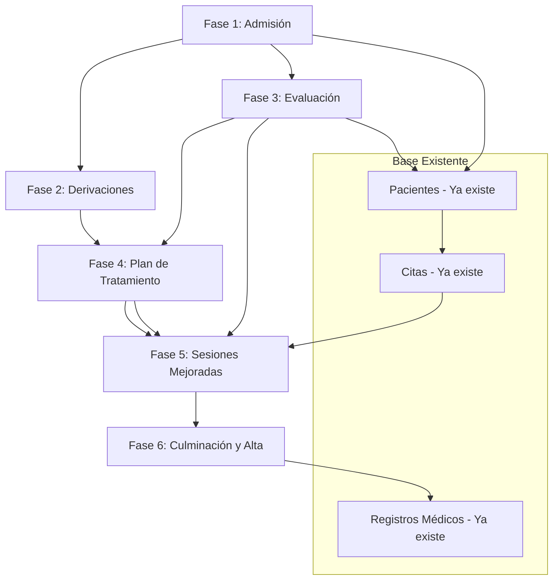

# Plan de Implementación: Flujo del Paciente en MediCore ERP

## Evaluación del Flujo Propuesto

### Fortalezas del Flujo Actual

1. **Enfoque centrado en el paciente**: El flujo sigue una lógica natural desde la llegada hasta el alta
2. **Integración con sistema existente**: Usa las tablas ya definidas (`patients`, `appointments`, `medical_records`)
3. **División en fases claras**: 9 fases bien diferenciadas y documentadas
4. **Uso de estándares médicos**: Incluye escalas validadas (VAS, Oswestry, DASH, WOMAC)
5. **Modelo SOAP implementado**: Las sesiones de fisioterapia siguen el estándar clínico

### Áreas de Mejora Identificadas

1. **Falta módulo de admisión de emergencia**: No existe pantalla específica para atención sin cita
2. **Sistema de derivaciones incompleto**: Falta la funcionalidad de `clinical_references`
3. **Evaluación fisioterapéutica parcial**: Solo existe el registro médico, falta la UI de evaluación completa
4. **No hay integración con citas**: Las sesiones de fisioterapia no se crean como citas
5. **Falta resumen de alta**: No hay generación automática de resumen para historia clínica

---

## Plan de Implementación por Fases

### Fase 1: Módulo de Admisión de Emergencia (Semana 1)

#### Objetivo
Crear pantalla de admisión rápida para pacientes sin cita previa

#### Componentes a desarrollar
1. **Pantalla de admisión de emergencia**
   ```
   app/(dashboard)/dashboard/admission/emergency/page.tsx
   ```
   - Búsqueda de paciente por DNI (ya implementado el componente)
   - Si existe → mostrar datos y opciones
   - Si no existe → formulario de registro rápido

2. **Componente PatientSearchByDni** (ya creado)
   - Mejorarlo para usar en admisión

3. **Quick Registration Form**
   ```
   app/(dashboard)/dashboard/admission/quick-register/page.tsx
   ```
   - Formulario simplificado con campos mínimos
   - Solo: DNI, Nombre, Apellido, Teléfono, DOB

#### Server Actions
```typescript
// En lib/actions/admission.ts
export async function quickRegisterPatient(formData: FormData)
export async function startEmergencyVisit(patientId: string)
export async function getOrCreateEmergencyAppointment(patientId: string)
```

---

### Fase 2: Sistema de Derivaciones (Semana 2)

#### Objetivo
Implementar flujo de derivación entre departamentos

#### Componentes a desarrollar
1. **Pantalla de derivación**
   ```
   app/(dashboard)/dashboard/referrals/new/page.tsx
   ```
   - Seleccionar paciente (con búsqueda por DNI)
   - Seleccionar departamento destino
   - Ingresar diagnóstico y notas

2. **Lista de derivaciones**
   ```
   app/(dashboard)/dashboard/referrals/page.tsx
   ```
   - Ver derivaciones pendientes
   - Aceptar/rechazar derivaciones

3. **API Routes**
   ```
   app/api/referrals/route.ts
   app/api/referrals/[id]/route.ts
   app/api/referrals/[id]/accept/route.ts
   ```

#### Tipos TypeScript
```typescript
interface ClinicalReference {
  id: string;
  patient_id: string;
  referring_doctor_id: string;
  referring_department_id: string;
  target_department_id: string;
  reference_type: 'evaluation' | 'treatment' | 'procedure' | 'consultation';
  clinical_diagnosis: string;
  icd10_codes: string[];
  priority: 'routine' | 'urgent' | 'emergency';
  notes?: string;
  status: 'pending' | 'accepted' | 'completed' | 'cancelled';
  created_at: string;
}
```

---

### Fase 3: Evaluación Fisioterapéutica Completa (Semana 3)

#### Objetivo
Crear UI completa para evaluación inicial de fisioterapia

#### Componentes a desarrollar
1. **Pantalla de evaluación**
   ```
   app/(dashboard)/dashboard/physiotherapy/evaluation/new/page.tsx
   ```
   - Datos del paciente (readonly)
   - Chief complaint con selector de dolor corporal
   - Escala VAS interactiva
   - Antecedentes médicos
   - Examen físico con mediciones ROM
   - Fuerza muscular (escala 0-5)
   - Escalas validadas (Oswestry, DASH, etc.)
   - Diagnóstico fisioterapéutico
   - Objetivos terapéuticos

2. **Componentes reutilizables**
   ```
   components/physio/
   ├── PainDiagram.tsx        // Diagrama corporal para dolor
   ├── ROMMeasurement.tsx     // Medición de rango de movimiento
   ├── StrengthGrade.tsx      // Evaluación de fuerza muscular
   ├── VASScale.tsx           // Escala visual análoga del dolor
   ├── OswestryQuestionnaire.tsx
   ├── DASHQuestionnaire.tsx
   └── GoalsInput.tsx         // Entrada de objetivos terapéuticos
   ```

#### Server Actions
```typescript
// En lib/actions/physiotherapy.ts
export async function createPhysioEvaluation(formData: FormData)
export async function getPatientPhysioHistory(patientId: string)
```

---

### Fase 4: Plan de Tratamiento (Semana 4)

#### Objetivo
Crear pantalla de plan de tratamiento y programación de sesiones

#### Componentes a desarrollar
1. **Pantalla de plan de tratamiento**
   ```
   app/(dashboard)/dashboard/physiotherapy/plans/new/page.tsx
   ```
   - Vinculación a evaluación existente
   - Selección de tipo de plan
   - Catálogos de tratamientos (ya existen)
   - Programación de sesiones

2. **Calendario de sesiones**
   ```
   app/(dashboard)/dashboard/physiotherapy/calendar/page.tsx
   ```
   - Vista mensual/semanal/diaria
   - Drag & drop para reprogramar
   - Filtros por fisioterapeuta

3. **Generador de sesiones**
   ```
   components/physio/SessionScheduler.tsx
   ```
   - Crear múltiples sesiones automáticamente
   - Configurar frecuencia y duración

#### Tipos TypeScript
```typescript
interface PhysioTreatmentPlan {
  id: string;
  patient_id: string;
  evaluation_id: string;
  diagnosis_code: string;
  plan_type: 'rehabilitation' | 'conditioning' | 'prevention' | 'maintenance';
  sessions_per_week: number;
  total_sessions_prescribed: number;
  status: 'active' | 'completed' | 'cancelled' | 'on_hold';
  // ... más campos
}
```

---

### Fase 5: Sesiones de Fisioterapia Mejoradas (Semana 5)

#### Objetivo
Mejorar el registro de sesiones con modelo SOAP completo

#### Componentes a desarrollar
1. **Pantalla de sesión mejorada**
   ```
   app/(dashboard)/dashboard/physiotherapy/sessions/[id]/edit/page.tsx
   ```
   - Subjetivo: notas de voz + texto
   - Objetivo: mediciones ROM y fuerza
   - Análisis: evaluación de progreso
   - Plan: ejercicios para casa
   - Evolución funcional
   - Firma digital del fisioterapeuta

2. **Evolución funcional**
   ```
   components/physio/FunctionalEvolution.tsx
   ```
   - Comparación con sesión anterior
   - Gráficos de progreso
   - Cálculo automático de mejora

3. **Alerta de progreso**
   ```
   components/physio/ProgressAlert.tsx
   ```
   - Notificar si no hay mejora después de N sesiones
   - Alertas configurables

---

### Fase 6: Culminación y Alta (Semana 6)

#### Objetivo
Crear flujo de culminación de tratamiento y registro en historia clínica

#### Componentes a desarrollar
1. **Pantalla de evaluación final**
   ```
   app/(dashboard)/dashboard/physiotherapy/plans/[id]/finalize/page.tsx
   ```
   - Evaluación comparativa (inicio vs final)
   - Medidas de resultado finales
   - Recomendaciones post-alta
   - Generación de resumen

2. **Generador de resumen de alta**
   ```
   components/discharge/PhysioDischargeSummary.tsx
   ```
   - Resumen del tratamiento
   - Objetivos cumplidos
   - Recomendaciones
   - Plan de seguimiento

3. **Integración con historia clínica**
   ```
   lib/actions/medical-records.ts
   ```
   - Nueva función para registrar alta de fisioterapia
   - Vincular con `medical_records` principal

#### Tipos TypeScript
```typescript
interface PhysioDischargeSummary {
  plan_id: string;
  evaluation_id: string;
  sessions_completed: number;
  sessions_attended: number;
  initial_vas: number;
  final_vas: number;
  pain_improvement_percent: number;
  objectives_achieved: string[];
  objectives_not_achieved: string[];
  final_recommendations: string;
  follow_up_required: boolean;
  follow_up_date?: string;
  patient_satisfaction: 1 | 2 | 3 | 4 | 5;
}
```

---

## Diagrama de Dependencias entre Fases



---

## Priorización Recomendada

| Prioridad | Fase | Razón |
|-----------|------|-------|
| 1 | Fase 1 | Necesario para atención sin cita |
| 2 | Fase 3 | Evaluación es la base del tratamiento |
| 3 | Fase 4 | Plan de tratamiento es core del módulo |
| 4 | Fase 5 | Sesiones son el día a día |
| 5 | Fase 2 | Derivaciones son opcionales al inicio |
| 6 | Fase 6 | Alta puede ser manual inicialmente |

---

## Métricas de Éxito por Fase

### Fase 1: Admisión
- Tiempo promedio de registro < 2 minutos
- Tasa de pacientes encontrados por DNI > 80%

### Fase 2: Derivaciones
- Tiempo de respuesta a derivaciones < 24 horas
- Tasa de aceptación de derivaciones > 90%

### Fase 3: Evaluación
- Tiempo de evaluación inicial < 30 minutos
- Completitud de datos > 95%

### Fase 4: Plan de Tratamiento
- Tiempo de creación de plan < 15 minutos
- Uso de catálogos > 70%

### Fase 5: Sesiones
- Tiempo de registro de sesión < 10 minutos
- Tasa de asistencia a sesiones programadas > 80%

### Fase 6: Alta
- Tiempo de generación de resumen < 5 minutos
- Satisfacción del paciente > 4/5

---

## Riesgos y Mitigaciones

| Riesgo | Probabilidad | Impacto | Mitigación |
|--------|--------------|---------|------------|
| Resistencia del personal | Media | Alto | Capacitación + UX intuitiva |
| Datos incompletos en evaluación | Alta | Medio | Validaciones + campos obligatorios |
| Retraso en programación de sesiones | Media | Medio | Calendario integrado + recordatorios |
| Integración con historia clínica | Baja | Alto | API bien definida + testing |

---

## Próximos Pasos Inmediatos

1. **Revisar este plan** y validar prioridades con el equipo
2. **Crear historias de usuario** para Fase 1 (Admisión)
3. **Diseñar mockups** de la pantalla de admisión
4. **Comenzar desarrollo** de Fase 1
