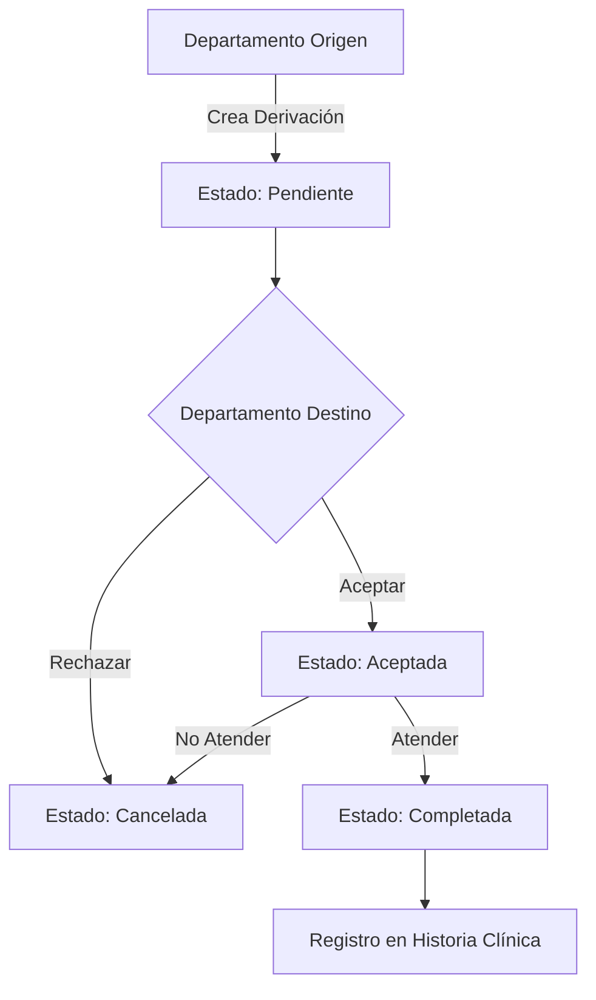

# Manual de Usuario Completo - MediCore ERP

## Sistema Integral de Gestión Hospitalaria

**Versión:** 2.0  
**Última Actualización:** Enero 2025  
**Desarrollado con:** Next.js 14, Supabase, TypeScript, Tailwind CSS

---

## Tabla de Contenidos

1. [Introducción General](#1-introducción-general)
2. [Primeros Pasos](#2-primeros-pasos)
3. [Módulo de Gestión de Pacientes](#3-módulo-de-gestión-de-pacientes)
4. [Módulo de Citas Médicas](#4-módulo-de-citas-médicas)
5. [Módulo de Historia Clínica Electrónica](#5-módulo-de-historia-clínica-electrónica)
6. [Módulo de Fisioterapia](#6-módulo-de-fisioterapia)
7. [Módulo de Farmacia](#7-módulo-de-farmacia)
8. [Módulo de Laboratorio](#8-módulo-de-laboratorio)
9. [Módulo de Facturación](#9-módulo-de-facturación)
10. [Módulo de Derivaciones](#10-módulo-de-derivaciones)
11. [Administración del Sistema](#11-administración-del-sistema)
12. [Referencia Técnica](#12-referencia-técnica)

---

## 1. Introducción General

### 1.1 ¿Qué es MediCore ERP?

MediCore ERP es un sistema integral de gestión hospitalaria diseñado para digitalizar y optimizar todos los procesos clínicos, administrativos y financieros de instituciones de salud. El sistema ofrece una plataforma unificada que conecta todos los departamentos del hospital, desde la admisión de pacientes hasta la facturación final.

### 1.2 Características Principales

| Característica | Descripción |
|----------------|-------------|
| **Historia Clínica Electrónica** | Registro digital completo de cada paciente con historial médico, diagnósticos y tratamientos |
| **Gestión de Citas** | Sistema de agendamiento con calendario visual y recordatorios automáticos |
| **Módulos Especializados** | Fisioterapia, Farmacia, Laboratorio, Facturación integrados |
| **Control de Acceso por Roles** | Permisos granulares según el rol del usuario |
| **Reportes y Analytics** | Dashboard con métricas en tiempo real |
| **Cumplimiento Normativo** | Soporte para códigos ICD-10, Consentimientos Informados Digitales |

### 1.3 Roles de Usuario

| Rol | Permisos | Acceso Principal |
|-----|----------|------------------|
| **Administrador** | Acceso completo al sistema | Todos los módulos |
| **Médico** | Gestión de pacientes, citas, historia clínica | Pacientes, Citas, Historia Clínica |
| **Fisioterapeuta** | Gestión de evaluaciones y tratamientos de fisioterapia | Módulo Fisioterapia |
| **Enfermero** | Consulta y registro de signos vitales | Historia Clínica |
| **Recepción** | Gestión de pacientes y citas | Pacientes, Citas |
| **Farmacéutico** | Inventario y dispensación | Farmacia |
| **Laboratorista** | Gestión de órdenes y resultados | Laboratorio |
| **Facturador** | Gestión de facturas y pagos | Facturación |

---

## 2. Primeros Pasos

### 2.1 Inicio de Sesión

1. Acceda a la URL de MediCore ERP proporcionada por su administrador
2. Ingrese sus credenciales (email y contraseña)
3. Si está habilitado, complete la autenticación de dos factores
4. Click en "Iniciar Sesión"

```
Credenciales de Prueba (desarrollo):
- Administrador: admin@medicore.com / admin123
- Médico: doctor@medicore.com / doctor123
- Fisioterapeuta: physio@medicore.com / physio123
- Recepción: recepcion@medicore.com / recepcion123
```

### 2.2 Interfaz Principal

La interfaz de MediCore ERP se divide en las siguientes secciones:

```
┌─────────────────────────────────────────────────────────────────┐
│  Logo MediCore    │  Búsqueda Global          │  Notificaciones │
├───────────────────┼───────────────────────────┼─────────────────┤
│                   │                           │                 │
│  NAVEGACIÓN       │      ÁREA DE TRABAJO      │  Panel Lateral  │
│  Lateral          │                           │  Derecho        │
│                   │                           │                 │
│  • Dashboard      │   Contenido Principal     │  • Acciones     │
│  • Pacientes      │   de la Página Actual     │  Rápidas        │
│  • Citas          │                           │  • Alertas      │
│  • Historia       │                           │  • Calendario   │
│  • Fisioterapia   │                           │                 │
│  • Farmacia       │                           │                 │
│  • Laboratorio    │                           │                 │
│  • Facturación    │                           │                 │
│  • Configuración  │                           │                 │
│                   │                           │                 │
├───────────────────┴───────────────────────────┴─────────────────┤
│  Barra Inferior: Usuario Actual | Rol | Help | Cerrar Sesión    │
└─────────────────────────────────────────────────────────────────┘
```

### 2.3 Navegación por Teclado

| Atajo | Acción |
|-------|--------|
| `Ctrl+N` | Nuevo registro |
| `Ctrl+S` | Guardar |
| `Ctrl+F` | Buscar |
| `Ctrl+R` | Recargar datos |
| `Esc` | Cancelar/Cerrar modal |
| `Ctrl+Enter` | Enviar formulario |

---

## 3. Módulo de Gestión de Pacientes

### 3.1 Registro de Nuevo Paciente

1. Navegue a **Pacientes → Nuevo Paciente**
2. Complete los campos obligatorios marcados con asterisco (*)
3. Click en **Guardar** para registrar al paciente

#### 3.1.1 Datos Demográficos

| Campo | Descripción | Formato |
|-------|-------------|---------|
| **Nombre(s)** | Nombre completo del paciente | Texto |
| **Apellidos** | Apellidos completos | Texto |
| **DNI/Cédula** | Documento de identificación | Alfanumérico |
| **Fecha de Nacimiento** | Fecha de nacimiento | DD/MM/AAAA |
| **Sexo** | Género del paciente | Lista desplegable |
| **Estado Civil** | Estado civil | Lista desplegable |
| **Email** | Correo electrónico | email@ejemplo.com |
| **Teléfono** | Teléfono de contacto | Números |
| **Dirección** | Domicilio completo | Texto |

#### 3.1.2 Información Médica

| Campo | Descripción |
|-------|-------------|
| **Tipo de Sangre** | Grupo sanguíneo y Rh |
| **Alergias** | Lista de alergias conocidas |
| **Enfermedades Crónicas** | Condiciones crónicas preexistentes |
| **Medicamentos Actuales** | Farmacoterapia actual |
| **Contacto de Emergencia** | Persona a contactar |

#### 3.1.3 Información de Seguro

| Campo | Descripción |
|-------|-------------|
| **Proveedor de Seguro** | Nombre de la aseguradora |
| **Número de Póliza** | Identificador de la póliza |
| **Titular de la Póliza** | Nombre del titular |
| **Vencimiento** | Fecha de expiración |

### 3.2 Búsqueda de Pacientes

El sistema ofrece múltiples métodos de búsqueda:

1. **Búsqueda por DNI**: Ingrese el número de documento
2. **Búsqueda por Nombre**: Escriba el nombre o apellido
3. **Búsqueda Avanzada**: Use filtros adicionales (fecha de nacimiento, género, etc.)

### 3.3 Perfil del Paciente

El perfil del paciente muestra:

```
┌─────────────────────────────────────────────────────────────┐
│  📋 PERFIL DEL PACIENTE                                     │
├─────────────────────────────────────────────────────────────┤
│  Foto     │  Nombre Completo                                │
│           │  DNI: 12345678  |  Edad: 35 años                │
│           │  📞 555-1234  |  ✉️ email@ejemplo.com           │
├─────────────────────────────────────────────────────────────┤
│  TABS:                                                      │
│  [Información] [Citas] [Historia Clínica] [Facturación]     │
├─────────────────────────────────────────────────────────────┤
│  📊 Resumen:                                                 │
│  • Última visita: 15/01/2025                                │
│  • Citas programadas: 2                                     │
│  • Balance pendiente: $150.00                               │
├─────────────────────────────────────────────────────────────┤
│  ACCIONES RÁPIDAS:                                          │
│  [Nueva Cita] [Ver Historia] [Nueva Receta] [Imprimir]      │
└─────────────────────────────────────────────────────────────┘
```

### 3.4 Historial del Paciente

El historial clínico incluye:

- **Notas de Consulta**: Todas las visitas médicas
- **Diagnósticos**: Lista de diagnósticos con códigos ICD-10
- **Recetas**: Historial de medicamentos prescritos
- **Exámenes**: Resultados de laboratorio e imagenología
- **Alergias Registradas**: Advertencias de alergias
- **Procedimientos**: Cirugías y procedimientos realizados

---

## 4. Módulo de Citas Médicas

### 4.1 Agendar Nueva Cita

1. Navegue a **Citas → Nueva Cita**
2. Complete los datos requeridos:
   - **Paciente**: Busque y seleccione el paciente
   - **Médico/Terapeuta**: Seleccione el profesional
   - **Tipo de Cita**: Consulta, Seguimiento, Urgencia, etc.
   - **Fecha y Hora**: Seleccione la fecha y hora
   - **Duración**: Tiempo estimado de la cita
   - **Motivo**: Descripción del motivo de la consulta

### 4.2 Estados de Cita

| Estado | Color | Descripción |
|--------|-------|-------------|
| **Programada** | Azul | Cita confirmada |
| **En Proceso** | Amarillo | Cita en curso |
| **Completada** | Verde | Cita finalizada |
| **Cancelada** | Rojo | Cita cancelada |
| **No Asistió** | Gris | Paciente no asistió |

### 4.3 Calendario de Citas

La vista de calendario muestra:

```
enero 2025
┌──────┬──────┬──────┬──────┬──────┬──────┬──────┐
│ Lu   │ Ma   │ Mi   │ Ju   │ Vi   │ Sáb  │ Dom  │
├──────┼──────┼──────┼──────┼──────┼──────┼──────┤
│   6  │   7  │   8  │   9  │  10  │  11  │  12  │
│ 📅 3 │ 📅 2 │ 📅 5 │ 📅 4 │ 📅 6 │      │      │
├──────┼──────┼──────┼──────┼──────┼──────┼──────┤
│  13  │  14  │  15  │  16  │  17  │  18  │  19  │
│ 📅 2 │ 📅 4 │ 📅 8 │ 📅 3 │ 📅 5 │      │      │
└──────┴──────┴──────┴──────┴──────┴──────┴──────┘
```

### 4.4 Recordatorios Automáticos

El sistema envía recordatorios automáticos:

- **24 horas antes**: Email al paciente
- **2 horas antes**: SMS (si está configurado)
- **15 minutos antes**: Notificación push

---

## 5. Módulo de Historia Clínica Electrónica

### 5.1 Estructura de la Historia Clínica

```
HISTORIA CLÍNICA ELECTRÓNICA
├── Datos del Paciente
├── Signos Vitales
├── Antecedentes
│   ├── Personales
│   ├── Familiares
│   ├── Quirúrgicos
│   └── Alérgicos
├── Nota de Evolución (SOAP)
│   ├── Subjetivo
│   ├── Objetivo
│   ├── Análisis
│   └── Plan
├── Diagnósticos (ICD-10)
├── Planes de Tratamiento
├── Recetas Médicas
└── Archivos Adjuntos
```

### 5.2 Registro de Signos Vitales

| Signo Vital | Rango Normal | Unidad |
|-------------|--------------|--------|
| Presión Arterial Sistólica | 90-120 | mmHg |
| Presión Arterial Diastólica | 60-80 | mmHg |
| Frecuencia Cardíaca | 60-100 | lpm |
| Temperatura | 36.1-37.2 | °C |
| Saturación de Oxígeno | 95-100 | % |
| Frecuencia Respiratoria | 12-20 | rpm |

### 5.3 Modelo SOAP

#### Subjetivo (S)
- Quejas principales del paciente
- Síntomas referidos
- Dolor (localización, intensidad, características)
- Cambios desde la última consulta

#### Objetivo (O)
- Signos vitales registrados
- Exploración física del día
- Hallazgos clínicos objetivos
- Resultados de pruebas

#### Análisis (A)
- Evaluación del progreso
- Comparación con visitas anteriores
- Interpretación de hallazgos
- Diagnóstico diferencial

#### Plan (P)
- Plan de tratamiento
-Medicamentos prescritos
- Exámenes ordenados
- Próxima cita

### 5.4 Códigos ICD-10

El sistema soporta la clasificación internacional de enfermedades:

```typescript
// Ejemplos de códigos ICD-10
const icd10Examples = [
  { code: 'M54.5', description: 'Dolor lumbar bajo' },
  { code: 'J06.9', description: 'Infección respiratoria aguda' },
  { code: 'E11.9', description: 'Diabetes mellitus tipo 2' },
  { code: 'I10', description: 'Hipertensión esencial' },
];
```

---

## 6. Módulo de Fisioterapia

### 6.1 Dashboard de Fisioterapia

El dashboard principal muestra:

```
┌─────────────────────────────────────────────────────────────┐
│  🏥 FISIOTERAPIA - Dashboard                                 │
├─────────────────────────────────────────────────────────────┤
│  ESTADÍSTICAS:                                               │
│  ┌─────────┐ ┌─────────┐ ┌─────────┐ ┌─────────┐           │
│  │ Pacientes│ │ Sesiones│ │ Planes  │ │ Derivac.│           │
│  │ Activos  │ │ Hoy     │ │ Activos │ │ Pend.   │           │
│  │    24    │ │    18   │ │    12   │ │     5   │           │
│  └─────────┘ └─────────┘ └─────────┘ └─────────┘           │
├─────────────────────────────────────────────────────────────┤
│  ACCESOS RÁPIDOS:                                            │
│  [Nueva Evaluación] [Ver Planes] [Ver Sesiones] [Derivaciones]│
└─────────────────────────────────────────────────────────────┘
```

### 6.2 Evaluación Inicial de Fisioterapia

La evaluación inicial se compone de 5 pasos:

#### Paso 1: Datos del Paciente
- Selección de paciente existente
- Verificación de información demográfica

#### Paso 2: Motivo de Consulta
| Campo | Descripción |
|-------|-------------|
| **Motivo Principal** | Descripción del problema |
| **Ubicación del Dolor** | Región corporal afectada |
| **Duración** | Tiempo con el problema |
| **Tipo de Dolor** | Agudo, crónico, punzante, etc. |
| **Escala VAS** | Intensidad del dolor (0-10) |

#### Paso 3: Antecedentes Clínicos
- Antecedentes quirúrgicos
- Antecedentes traumáticos
- Antecedentes médicos
- Alergias
- Contraindicaciones

#### Paso 4: Exploración Física
- Evaluación postural
- Exploración general
- Screening neurológico
- Tests especiales
- **Rangos de Movimiento (ROM)**
- **Fuerza Muscular (Escala Oxford 0-5)**

#### Paso 5: Diagnóstico y Plan
- Diagnóstico fisioterapéutico
- Código CIE-10
- Objetivos a corto plazo
- Objetivos a largo plazo
- Consentimiento informado

### 6.3 Herramientas de Evaluación

#### Escala Visual Analógica del Dolor (VAS)

```
0 ──────► 10
Sin dolor ──► Dolor máximo
```

| Valor | Nivel | Color |
|-------|-------|-------|
| 0-2 | Leve | Verde |
| 3-5 | Moderado | Amarillo |
| 6-8 | Severo | Naranja |
| 9-10 | Insoportable | Rojo |

#### Escala de Fuerza Muscular (Oxford)

| Grado | Descripción |
|-------|-------------|
| 0 | Parálisis total |
| 1 | Contracción visible sin movimiento |
| 2 | Movimiento con gravedad eliminada |
| 3 | Movimiento contra gravedad |
| 4 | Movimiento contra resistencia parcial |
| 5 | Fuerza normal |

### 6.4 Planes de Tratamiento

#### Tipos de Plan

| Tipo | Descripción | Duración Típica |
|------|-------------|-----------------|
| **Rehabilitación** | Recuperación post-lesión/cirugía | 4-12 semanas |
| **Mantenimiento** | Conservar función alcanzada | Indefinida |
| **Preventivo** | Prevención de lesiones | Variable |
| **Rendimiento** | Optimización deportiva | Variable |

#### Crear Plan de Tratamiento

1. Ir a **Fisioterapia → Planes → Nuevo Plan**
2. Seleccionar paciente
3. (Opcional) Vincular evaluación existente
4. Ingresar diagnóstico y tipo de plan
5. Configurar programación:
   - Fecha de inicio
   - Sesiones por semana
   - Total de sesiones prescritas
6. Guardar plan

### 6.5 Sesiones de Fisioterapia (Modelo SOAP)

#### Crear Nueva Sesión

1. Ir a **Fisioterapia → Sesiones → Nueva Sesión**
2. Seleccionar paciente y (opcional) plan de tratamiento
3. Completar datos SOAP:

##### Subjetivo (S)
```
- Dolor actual (VAS 0-10)
- Cambios desde última sesión
- Que refiere el paciente
```

##### Objetivo (O)
```
- ROM medido (en grados)
- Fuerza muscular (0-5)
- Tests realizados
- Exploración física del día
```

##### Análisis (A)
```
- Evaluación del progreso
- Comparación con sesión anterior
- Respuesta al tratamiento
```

##### Plan (P)
```
- Técnicas aplicadas
- Ejercicios para casa
- Próxima sesión programada
```

### 6.6 Culminación y Alta

1. Ir al **Plan de Tratamiento**
2. Click en **Culminar Plan**
3. Completar evaluación final:
   - Dolor inicial vs final (cálculo automático de mejora %)
   - Objetivos logrados
   - Objetivos no logrados
   - Recomendaciones post-alta
   - ¿Requiere seguimiento?
4. Click en **Completar Alta**

El sistema genera el **Resumen de Alta** que incluye:
- Datos del paciente
- Período de tratamiento
- Total sesiones asistidas
- Objetivos cumplidos
- Recomendaciones
- Score de satisfacción

### 6.7 Derivaciones a Fisioterapia

El sistema permite derivar pacientes desde otros departamentos:

1. Ir a **Fisioterapia → Derivaciones → Nueva Derivación**
2. Seleccionar paciente
3. Seleccionar departamento origen
4. Ingresar diagnóstico y notas clínicas
5. Enviar derivación

El fisioterapeuta recibe la derivación y puede:
- **Aceptar**: Iniciar evaluación
- **Rechazar**: Con理由 clínica

---

## 7. Módulo de Farmacia

### 7.1 Inventario de Medicamentos

| Campo | Descripción |
|-------|-------------|
| **Código** | Identificador único |
| **Nombre** | Nombre del medicamento |
| **Principio Activo** | Componente activo |
| **Forma Farmacéutica** | Tableta, cápsula, jarabe, etc. |
| **Concentración** | Dosis del medicamento |
| **Stock Actual** | Cantidad disponible |
| **Stock Mínimo** | Alerta de reposición |
| **Proveedor** | Laboratorio/Supplier |
| **Vencimiento** | Fecha de caducidad |

### 7.2 Dispensación de Recetas

1. Navegue a **Farmacia → Dispensación**
2. Escanee o busque la receta médica
3. Verifique los datos del paciente
4. Seleccione los medicamentos
5. Confirme la dispensación
6. Imprimir ticket

### 7.3 Alertas de Inventario

El sistema genera alertas cuando:

- Stock por debajo del mínimo
- Medicamentos próximos a vencer
- Interacciones medicamentosas detectadas
- Recetas duplicadas

### 7.4 Movimientos de Inventario

| Tipo | Descripción |
|------|-------------|
| **Entrada** | Compra/Recepción de mercancía |
| **Salida** | Dispensación a pacientes |
| **Transferencia** | Entre sucursales/departamentos |
| **Ajuste** | Corrección de inventario |
| **Devolución** | Medicamentos devueltos |

---

## 8. Módulo de Laboratorio

### 8.1 Órdenes de Laboratorio

1. Ir a **Laboratorio → Nueva Orden**
2. Seleccionar paciente
3. Seleccionar exámenes requeridos
4. (Opcional) Agregar notas clínicas
5. Confirmar y enviar a laboratorio

### 8.2 Catálogo de Exámenes

| Categoría | Ejemplos |
|-----------|----------|
| **Hematología** | BH, Grupo sanguíneo, Coagulación |
| **Química Clínica** | Glucosa, Perfil lipídico, Función renal |
| **Inmunología** | Pruebas serológicas, Hormonas |
| **Microbiología** | Cultivos, Antibiogramas |
| **Imagenología** | Rayos X, Ultrasonido, Resonancia |

### 8.3 Registro de Resultados

1. Abrir orden de laboratorio
2. Ingresar resultados de cada prueba
3. Validar resultados anormales
4. Firmar digitalmente
5. Notificar al médico solicitante

### 8.4 Impresión de Resultados

El sistema genera reportes imprimibles con:
- Datos del paciente
- Fecha de muestra y análisis
- Resultados con valores de referencia
- Flags para valores anormales
- Firma del laboratorista

---

## 9. Módulo de Facturación

### 9.1 Crear Factura

1. Ir a **Facturación → Nueva Factura**
2. Seleccionar paciente
3. Agregar conceptos/servicios:
   - Consultas
   - Procedimientos
   - Exámenes de laboratorio
   - Medicamentos
   - Habitación
4. Aplicar descuentos (si aplica)
5. Calcular impuestos
6. Guardar y emitir

### 9.2 Estados de Factura

| Estado | Color | Descripción |
|--------|-------|-------------|
| **Pendiente** | Amarillo | Factura creada, sin pago |
| **Parcial** | Naranja | Pago parcial recibido |
| **Pagada** | Verde | Pago completo |
| **Vencida** | Rojo | Plazo de pago excedido |
| **Anulada** | Gris | Factura cancelada |

### 9.3 Métodos de Pago

- Efectivo
- Tarjeta de Débito/Crédito
- Transferencia Bancaria
- Cheque
- Pago en Línea (Stripe/PayPal)

### 9.4 Reportes Financieros

| Reporte | Descripción |
|---------|-------------|
| **Cuentas por Cobrar** | Facturas pendientes |
| **Ingresos por Período** | Resumen de ingresos |
| **Por Departamento** | Distribución de ingresos |
| **Estado de Cuenta** | Movimientos de paciente |

---

## 10. Módulo de Derivaciones

### 10.1 Crear Derivación

1. Ir a **Derivaciones → Nueva Derivación**
2. Seleccionar paciente
3. Seleccionar departamento origen
4. Seleccionar departamento destino
5. Tipo de derivación:
   - Evaluación
   - Tratamiento
   - Procedimiento
   - Consulta
6. Prioridad:
   - Rutinaria
   - Urgente
   - Emergencia
7. Ingresar diagnóstico y notas clínicas
8. Enviar derivación

### 10.2 Gestión de Derivaciones

#### Lista de Derivaciones

Muestra todas las derivaciones con filtros por:
- Estado (Pendiente, Aceptada, Completada, Cancelada)
- Departamento
- Fecha
- Prioridad

#### Acciones sobre Derivaciones

| Acción | Descripción |
|--------|-------------|
| **Ver** | Detalles completos de la derivación |
| **Aceptar** | Aceptar y agendar atención |
| **Rechazar** | Rechazar con理由 clínica |
| **Completar** | Marcar como atendida |

### 10.3 Flujo de Derivaciones



---

## 11. Administración del Sistema

### 11.1 Gestión de Usuarios

#### Crear Usuario

1. Ir a **Administración → Usuarios → Nuevo Usuario**
2. Completar datos:
   - Nombre completo
   - Email
   - Rol
   - Especialidad (para médicos)
   - Permisos adicionales
3. Asignar credenciales temporales
4. Guardar

#### Modificar Permisos

Los permisos se asignan por rol:

| Permiso | Descripción |
|---------|-------------|
| **Leer** | Ver registros |
| **Crear** | Crear nuevos registros |
| **Editar** | Modificar registros existentes |
| **Eliminar** | Eliminar registros |
| **Exportar** | Exportar datos |
| **Administración** | Acceso a configuración del sistema |

### 11.2 Configuración del Sistema

#### Parámetros Generales

- Nombre de la institución
- Logo y colores institucionales
- Formato de fecha y hora
- Zona horaria
- Moneda predeterminada

#### Notificaciones

- Configurar servidor de email (SMTP)
- Plantillas de email
- Configuración de SMS
- Notificaciones push

### 11.3 Respaldo y Recuperación

El sistema realiza:
- **Respaldo automático**: Diario a las 3:00 AM
- **Retención**: 30 días de respaldos
- **Recuperación**: Restauración desde panel de administración

### 11.4 Auditoría

El sistema registra todas las acciones:

| Registro | Descripción |
|----------|-------------|
| **Usuarios** | Creación, modificación, eliminación |
| **Sesiones** | Inicios y cierres de sesión |
| **Accesos** | Acceso a datos sensibles |
| **Modificaciones** | Cambios en registros |

---

## 12. Referencia Técnica

### 12.1 Estructura del Proyecto

```
medicore-erp/
├── app/                          # Aplicación Next.js 14
│   ├── (auth)/                   # Rutas de autenticación
│   ├── (dashboard)/              # Rutas protegidas
│   │   └── dashboard/            # Módulos del sistema
│   │       ├── patients/         # Pacientes
│   │       ├── appointments/     # Citas
│   │       ├── physiotherapy/    # Fisioterapia
│   │       ├── pharmacy/         # Farmacia
│   │       ├── lab/              # Laboratorio
│   │       └── billing/          # Facturación
│   └── api/                      # API Routes
├── components/                   # Componentes reutilizables
│   ├── physio/                   # Componentes de fisioterapia
│   └── discharge/                # Componentes de alta
├── lib/                          # Utilidades
│   ├── supabase/                 # Clientes Supabase
│   ├── types/                    # Tipos TypeScript
│   └── actions/                  # Server Actions
└── supabase/
    └── migrations/               # Migraciones de BD
```

### 12.2 Base de Datos (Supabase)

#### Tablas Principales

| Tabla | Descripción |
|-------|-------------|
| `patients` | Registro de pacientes |
| `appointments` | Citas médicas |
| `medical_records` | Historia clínica |
| `physio_medical_records` | Evaluaciones de fisioterapia |
| `physio_sessions` | Sesiones de fisioterapia |
| `physio_treatment_plans` | Planes de tratamiento |
| `clinical_references` | Derivaciones |
| `pharmacy_inventory` | Inventario de farmacia |
| `lab_orders` | Órdenes de laboratorio |
| `billing_invoices` | Facturas |

### 12.3 APIs y Endpoints

#### Endpoints de Fisioterapia

| Método | Endpoint | Descripción |
|--------|----------|-------------|
| GET | `/api/physio/records` | Listar evaluaciones |
| POST | `/api/physio/records` | Crear evaluación |
| GET | `/api/physio/records/[id]` | Obtener evaluación |
| PUT | `/api/physio/records/[id]` | Actualizar evaluación |
| GET | `/api/physio/plans` | Listar planes |
| POST | `/api/physio/plans` | Crear plan |
| PUT | `/api/physio/plans/[id]/finalize` | Finalizar plan |
| GET | `/api/physio/sessions` | Listar sesiones |
| POST | `/api/physio/sessions` | Crear sesión |
| GET | `/api/referrals` | Listar derivaciones |
| POST | `/api/referrals` | Crear derivación |

### 12.4 Componentes Reutilizables

#### VASScale
```tsx
import { VASScale } from '@/components/physio';

<VASScale
  value={painLevel}
  onChange={(value) => setPainLevel(value)}
  label="Nivel de dolor"
/>
```

#### StrengthGrade
```tsx
import { StrengthGrade } from '@/components/physio';

<StrengthGrade
  value={strength}
  onChange={(value) => setStrength(value)}
  label="Fuerza muscular"
  side="right"
/>
```

#### ROMMeasurement
```tsx
import { ROMMeasurement } from '@/components/physio';

<ROMMeasurement
  value={romValue}
  onChange={(value) => setRomValue(value)}
  label="Rango de movimiento"
  max={180}
/>
```

### 12.5 Configuración de Variables de Entorno

```env
# Supabase
NEXT_PUBLIC_SUPABASE_URL=your-project-url
NEXT_PUBLIC_SUPABASE_ANON_KEY=your-anon-key

# Opcional: Email (para notificaciones)
SMTP_HOST=smtp.example.com
SMTP_PORT=587
SMTP_USER=your-email
SMTP_PASSWORD=your-password

# Opcional: SMS
TWILIO_ACCOUNT_SID=your-account-sid
TWILIO_AUTH_TOKEN=your-auth-token
TWILIO_PHONE_NUMBER=your-phone-number
```

### 12.6 Troubleshooting Común

| Problema | Solución |
|----------|----------|
| No carga la página | Verificar conexión a internet; refrescar página |
| Error de autenticación | Verificar credenciales; revisar token |
| Datos no guardados | Verificar conexión a Supabase; revisar consola |
| Citas no aparecen | Verificar filtros de fecha; actualizar vista |
| Impresión fallida | Verificar conexión a impresora; revisar permisos |

### 12.7 Contacto de Soporte

Para soporte técnico:
- **Email**: soporte@medicore.com
- **Teléfono**: [Número de soporte]
- **Documentación**: [Enlace al docs]
- **Portal de Tickets**: [URL del sistema de tickets]

---

## Anexo A: Atajos de Teclado

| Atajo | Acción |
|-------|--------|
| `Ctrl+N` | Nuevo registro |
| `Ctrl+S` | Guardar |
| `Ctrl+Shift+S` | Guardar como borrador |
| `Ctrl+E` | Editar |
| `Ctrl+D` | Duplicar |
| `Ctrl+Del` | Eliminar |
| `Ctrl+F` | Buscar |
| `Ctrl+R` | Recargar datos |
| `Ctrl+P` | Imprimir |
| `Ctrl+Shift+E` | Exportar |
| `Esc` | Cancelar/Cerrar |
| `Enter` | Confirmar (en diálogos) |
| `Tab` | Navegar entre campos |

---

## Anexo B: Códigos de Error Comunes

| Código | Significado | Acción |
|--------|-------------|--------|
| E001 | Error de autenticación | Iniciar sesión nuevamente |
| E002 | Permiso denegado | Contactar administrador |
| E003 | Registro duplicado | Verificar datos únicos |
| E004 | Datos inválidos | Revisar campos requeridos |
| E005 | Error de conexión | Verificar conexión a internet |
| E006 | Timeout | Reintentar operación |

---

**Fin del Manual de Usuario**

*Este documento está sujeto a actualizaciones. Por favor, consulte la versión más reciente en el sistema.*
