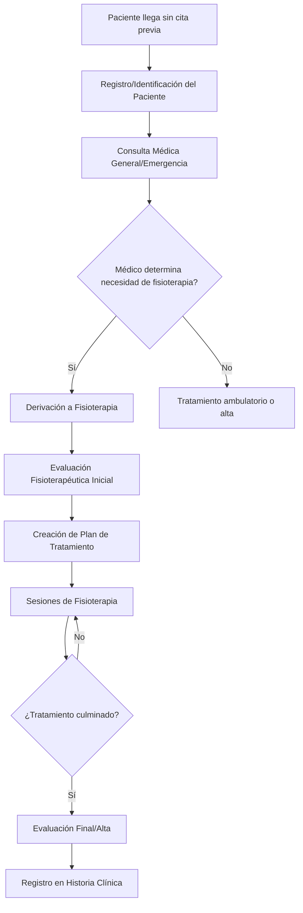

# Modelo de Flujo del Paciente en MediCore ERP

## Flujo Completo: Llegada sin Cita Previa → Tratamiento de Fisioterapia → Historia Clínica

Este documento describe el flujo completo de un paciente que llega al hospital sin cita previa, es derivado a fisioterapia, recibe evaluación médica especializada, se le indican sesiones de fisioterapia, y culmina su tratamiento registrado en la historia clínica.

---

## 1. Diagrama General del Flujo



---

## 2. Fase 1: Llegada y Registro del Paciente

### 2.1 Escenario: Paciente sin Cita Previa

**Punto de entrada:** Ventanilla de admisión de emergencia o consulta general

**Acciones del sistema:**
1. Verificar si el paciente ya existe en el sistema
   - Si existe: Mostrar datos del paciente para confirmar identidad
   - Si no existe: Mostrar formulario de registro rápido

**Datos mínimos requeridos para atención de emergencia:**
- DNI / Cédula (obligatorio, único)
- Nombre completo (first_name + last_name)
- Teléfono (para contacto)
- Fecha de nacimiento (para calcular edad)
- Género (para registros médicos)

**Flujo de pantalla:**
```
1. Pantalla de admisión de emergencia
   ├── Buscar paciente por DNI
   ├── Si existe: Mostrar datos + confirmar
   ├── Si no existe: Formulario de registro rápido
   └── Continuar a consulta médica
```

### 2.2 Datos del Paciente (según schema)

```typescript
interface Patient {
  id: string;                    // UUID
  medical_record_number: string; // Número de historia clínica
  dni: number;                   // Cédula de identidad (único)
  first_name: string;            // Nombres
  last_name: string;             // Apellidos
  email?: string | null;
  phone: string;                 // Teléfono de contacto
  dob: string;                   // Fecha de nacimiento
  gender?: GenderType | null;
  address?: string | null;
  city?: string | null;
  emergency_contact_name?: string | null;
  emergency_contact_phone?: string | null;
  blood_type?: string | null;
  allergies?: string[] | null;
  insurance_provider?: string | null;
  insurance_policy_number?: string | null;
  notes?: string | null;
  created_at: string;
  updated_at: string;
}
```

---

## 3. Fase 2: Consulta Médica Inicial

### 3.1 Tipos de Consulta para Paciente sin Cita

1. **Consulta de Emergencia** (urgente)
2. **Consulta General** (demanda espontánea)

### 3.2 Datos Recolectados en Consulta

**Motivo de consulta:**
- Chief complaint (queja principal)
- Historia de la enfermedad actual (HPI)

**Signos vitales:**
```json
{
  "blood_pressure": "120/80",
  "heart_rate": 72,
  "temperature": 36.5,
  "respiratory_rate": 16,
  "oxygen_saturation": 98,
  "weight": 70,
  "height": 170
}
```

**Examen físico:**
- Descripción textual del examen físico
- Hallazgos relevantes

### 3.3 Estructura de Citas (appointments)

```typescript
interface Appointment {
  id: string;
  patient_id: string;              // FK a patients
  doctor_id: string;               // FK a profiles
  department_id: string;           // FK a departments
  room_id?: string;                // FK a rooms
  appointment_type: 'consultation' | 'follow_up' | 'emergency' | 'procedure' | 'imaging' | 'laboratory' | 'surgery' | 'physiotherapy';
  status: AppointmentStatus;
  start_time: string;              // ISO timestamp
  end_time: string;                // ISO timestamp
  reason?: string;
  notes?: string;
  clinical_reference_type?: string;
  clinical_reference_id?: string;  // Si viene de otra referencia
  referring_department_id?: string; // Departamento que deriva
  workflow_status: string;
}
```

---

## 4. Fase 3: Derivación a Fisioterapia

### 4.1 Proceso de Derivación

Cuando el médico determina que el paciente necesita fisioterapia:

1. Crear referencia clínica (clinical_reference)
2. Seleccionar departamento de fisioterapia
3. Agendar cita de evaluación fisioterapéutica

### 4.2 Datos de Derivación

**Información del médico derivador:**
- Doctor ID (de profiles)
- Especialidad
- Diagnóstico preliminar (ICD-10 codes)

**Información del paciente:**
- Patient ID
- Resumen de diagnóstico

**Información de la derivación:**
```typescript
interface ClinicalReference {
  id: string;
  patient_id: string;
  referring_doctor_id: string;
  referring_department_id: string;
  target_department_id: string;     // fisioterapia
  reference_type: 'evaluation' | 'treatment' | 'procedure' | 'consultation';
  clinical_diagnosis: string;       // Diagnóstico clínico
  icd10_codes: string[];            // Códigos ICD-10
  priority: 'routine' | 'urgent' | 'emergency';
  notes?: string;
  status: 'pending' | 'accepted' | 'completed' | 'cancelled';
  created_at: string;
}
```

### 4.3 Pantalla de Derivación

```
Pantalla de Derivación a Fisioterapia
├── Datos del Paciente
│   ├── Nombre: [Nombre completo]
│   ├── DNI: [Número]
│   └── Edad: [X años]
├── Diagnóstico del Médico
│   ├── Diagnóstico principal: [Texto]
│   └── Códigos ICD-10: [Lista]
├── Historia Clínica Relevante
│   ├── Alergias: [Lista]
│   ├── Antecedentes: [Texto]
│   └── Medicación actual: [Texto]
└── Botones de Acción
    ├── Derivar a Fisioterapia
    └── Cancelar
```

---

## 5. Fase 4: Evaluación Fisioterapéutica Inicial

### 5.1 Proceso de Evaluación

Esta es la evaluación médica especializada que realiza el fisioterapeuta al paciente derivado.

### 5.2 Datos Recolectados en Evaluación Fisio

**Información del paciente (desde medical_records):**
```typescript
interface PhysioMedicalRecord {
  id: string;
  patient_id: string;
  therapist_id: string;           // FK a profiles (fisioterapeuta)
  department_id: string;           // FK a departments
  chief_complaint: string;         // Motivo de consulta fisioterapéutico
  pain_location: string;           // Localización del dolor
  pain_scale_baseline: number;     // Escala VAS 0-10
  pain_duration: string;           // Duración del dolor
  pain_type: string;               // Tipo de dolor
  pain_characteristics: string;    // Características del dolor
  
  // Antecedentes
  surgical_history: string;
  traumatic_history: string;
  medical_history: string;
  family_history: string;
  allergies: string[];
  contraindications: string[];
  precautions: string;
  
  // Examen físico fisioterapéutico
  physical_examination: string;
  postural_evaluation: string;
  rom_measurements: ROMMeasurement[]; // Rango de movimiento
  strength_grade: StrengthGrade[];    // Fuerza muscular
  neurological_screening: string;
  special_tests: string;
  
  // Escalas de evaluación
  vas_score: number;              // Visual Analog Scale 0-10
  oswestry_score: number;         // Índice de Discapacidad Oswestry 0-100
  dash_score: number;             // Disabilities of Arm, Shoulder, and Hand 0-100
  womac_score: number;            // Western Ontario McMaster Osteoarthritis Index 0-96
  roland_morris_score: number;    // Cuestionario de Discapacidad de Roland-Morris 0-24
  
  // Diagnóstico fisioterapéutico
  clinical_diagnosis: string;
  icd10_codes: string[];
  functional_limitations: string;
  
  // Objetivos terapéuticos
  short_term_goals: string[];     // Objetivos a corto plazo
  long_term_goals: string[];      // Objetivos a largo plazo
  patient_expectations: string;
  
  // Consentimiento
  informed_consent_signed: boolean;
  status: 'active' | 'completed' | 'cancelled';
  created_at: string;
  updated_at: string;
}
```

### 5.3 Examen Físico Detallado

**Mediciones de Rango de Movimiento (ROM):**
```typescript
interface ROMMeasurement {
  joint: string;           // e.g., "Hombro derecho", "Rodilla izquierda"
  movement: string;        // e.g., "Flexión", "Extensión", "Rotación interna"
  passive_rom: number;     // Grados
  active_rom: number;      // Grados
  limitation: string;      // Descripción de la limitación
}
```

**Grado de Fuerza Muscular:**
```typescript
interface StrengthGrade {
  muscle_group: string;    // e.g., "Cuadriceps", "Bíceps"
  side: 'right' | 'left' | 'bilateral';
  grade: number;           // 0-5 (Oxford scale)
  notes?: string;
}
```

### 5.4 Pantalla de Evaluación Fisioterapéutica

```
Evaluación Fisioterapéutica Inicial
├── Sección 1: Datos del Paciente
│   ├── Paciente: [Nombre]
│   ├── DNI: [Número]
│   ├── Fecha: [Fecha actual]
│   └── Fisioterapeuta: [Nombre]
│
├── Sección 2: Motivo de Consulta
│   ├── Chief Complaint: [Texto]
│   ├── Localización del dolor: [Diagrama corporal]
│   ├── Escala VAS (0-10): [Slider]
│   └── Duración del dolor: [Dropdown]
│
├── Sección 3: Antecedentes
│   ├── Quirúrgicos: [Texto]
│   ├── Traumáticos: [Texto]
│   ├── Médicos: [Texto]
│   ├── Alergias: [Tags]
│   └── Contraindicaciones: [Tags]
│
├── Sección 4: Examen Físico
│   ├── Evaluación postural: [Texto]
│   ├── ROM: [Tabla editable]
│   ├── Fuerza muscular: [Tabla editable]
│   ├── Screening neurológico: [Texto]
│   └── Pruebas especiales: [Texto]
│
├── Sección 5: Escalas Validadas
│   ├── VAS: [0-10]
│   ├── Oswestry: [0-100]
│   ├── DASH: [0-100]
│   ├── WOMAC: [0-96]
│   └── Roland-Morris: [0-24]
│
├── Sección 6: Diagnóstico y Plan
│   ├── Diagnóstico fisioterapéutico: [Texto]
│   ├── Códigos ICD-10: [Multi-select]
│   ├── Limitaciones funcionales: [Texto]
│   ├── Objetivos a corto plazo: [Lista]
│   ├── Objetivos a largo plazo: [Lista]
│   └── Expectativas del paciente: [Texto]
│
└── Sección 7: Consentimiento
    ├── Consentimiento informado firmado: [Checkbox]
    └── Firma del fisioterapeuta: [Digital]
```

---

## 6. Fase 5: Plan de Tratamiento de Fisioterapia

### 6.1 Estructura del Plan de Tratamiento

```typescript
interface PhysioTreatmentPlan {
  id: string;
  patient_id: string;
  prescribing_doctor_id: string;   // Médico que prescribe (opcional)
  department_id: string;
  diagnosis_code: string;          // Código ICD-10
  diagnosis_description: string;
  plan_type: 'rehabilitation' | 'conditioning' | 'prevention' | 'maintenance';
  clinical_objective: string;
  start_date: string;
  expected_end_date: string;
  actual_end_date?: string;
  status: 'active' | 'completed' | 'cancelled' | 'on_hold';
  sessions_per_week: number;       // Frecuencia
  total_sessions_prescribed: number;
  initial_assessment: string;
  baseline_rom: string;
  baseline_functional_score: number;
  progress_notes: string[];
  outcome_measures: string[];
  notes?: string;
  created_at: string;
  updated_at: string;
}
```

### 6.2 Elementos del Plan de Tratamiento

**Catálogos disponibles (ya implementados):**
- **Treatment Types** (`physio_treatment_types`): Tipos de tratamiento (electroterapia, terapia manual, ejercicio terapéutico, etc.)
- **Techniques** (`physio_techniques`): Técnicas específicas dentro de cada tipo
- **Equipment** (`physio_equipment`): Equipos a utilizar
- **Exercises** (`physio_exercises`): Ejercicios prescritos
- **Clinical Protocols** (`physio_clinical_protocols`): Protocolos clínicos estandarizados

### 6.3 Sesiones Programadas

```typescript
interface PhysioSession {
  id: string;
  appointment_id?: string;         // FK a appointments
  patient_id: string;
  therapist_id: string;            // FK a profiles
  treatment_plan_id?: string;      // FK a physio_treatment_plans
  medical_record_id?: string;      // FK a physio_medical_records
  
  // Datos de la sesión
  session_date: string;            // Fecha
  session_time: string;            // Hora
  duration_minutes: number;        // Duración (default 45)
  session_number: number;          // Número de sesión en el plan
  is_initial_session: boolean;
  is_reassessment: boolean;
  
  // Datos clínicos (SOAP)
  subjective: string;              // Subjetivo: Qué reporta el paciente
  objective: string;               // Objetivo: Qué observa el fisioterapeuta
  analysis: string;                // Análisis: Interpretación
  plan: string;                    // Plan: Próximos pasos
  
  // Parámetros específicos
  pain_level: number;              // VAS post-tratamiento 0-10
  pain_location?: string;
  rom_affected?: string;
  muscle_strength_grade?: number;  // 0-5
  muscle_group?: string;
  modality?: string;
  
  // Tratamientos aplicados (de catálogos)
  treatments_detail: TreatmentDetail[];
  techniques_applied: string[];    // IDs de técnicas
  exercises_applied: string[];     // IDs de ejercicios
  equipment_used: string[];        // IDs de equipos
  
  notes?: string;
  created_at: string;
  updated_at: string;
}
```

### 6.4 Pantalla de Plan de Tratamiento

```
Plan de Tratamiento de Fisioterapia
├── Sección 1: Información General
│   ├── Paciente: [Nombre]
│   ├── Diagnóstico: [Texto]
│   ├── Tipo de plan: [Dropdown]
│   └── Objetivos clínicos: [Texto]
│
├── Sección 2: Programación
│   ├── Fecha de inicio: [Date]
│   ├── Fecha esperada de fin: [Date]
│   ├── Sesiones por semana: [Number]
│   └── Total de sesiones: [Number]
│
├── Sección 3: Tratamientos Prescritos
│   ├── Tipo de tratamiento: [Dropdown - physio_treatment_types]
│   ├── Técnicas: [Multi-select - physio_techniques]
│   ├── Equipos: [Multi-select - physio_equipment]
│   ├── Ejercicios: [Multi-select - physio_exercises]
│   └── Protocolo clínico: [Dropdown - physio_clinical_protocols]
│
├── Sección 4: Objetivos
│   ├── Objetivos a corto plazo: [Lista]
│   ├── Objetivos a largo plazo: [Lista]
│   └── Medidas de resultado: [Lista]
│
└── Sección 5: Acciones
    ├── Guardar Plan
    ├── Iniciar Sesiones
    └── Cancelar
```

---

## 7. Fase 6: Sesiones de Fisioterapia

### 7.1 Ejecución de Sesión (Modelo SOAP)

**S - Subjetivo:**
- Qué reporta el paciente
- Dolor actual (VAS)
- Mejoría/empeoramiento desde última sesión
- Adherencia al tratamiento en casa

**O - Objetivo:**
- Examen objetivo
- ROM medido
- Fuerza muscular
- Evaluación funcional

**A - Análisis:**
- Interpretación de los hallazgos
- Progreso del paciente
- Necesidad de ajustar el plan

**P - Plan:**
- Próximas sesiones
- Ejercicios para casa
- Modificaciones al tratamiento

### 7.2 Evolución Funcional (para cada sesión)

```typescript
interface PhysioFunctionalEvolution {
  id: string;
  session_id: string;
  subjective_assessment: string;
  objective_findings: string;
  assessment: string;
  treatment_plan: string;
  pain_before: number;            // VAS antes
  pain_after: number;             // VAS después
  rom_measurements: ROMMeasurement[];
  strength_grade: StrengthGrade[];
  session_objectives: string[];
  objectives_achieved: string[];
  patient_response: string;
  tolerance: string;              // Tolerancia al tratamiento
  adverse_reactions: string;      // Reacciones adversas
  therapist_signature: string;    // UUID del fisioterapeuta
  signed_at: string;
  created_at: string;
}
```

### 7.3 Pantalla de Sesión de Fisioterapia

```
Sesión de Fisioterapia - [Número de sesión]
├── Sección 1: Datos de la Sesión
│   ├── Fecha: [Fecha]
│   ├── Hora: [Hora]
│   ├── Duración: [Minutos]
│   └── Fisioterapeuta: [Nombre]
│
├── Sección 2: Subjetivo (S)
│   ├── Dolor actual (VAS 0-10): [Slider]
│   ├── Qué reporta el paciente: [Texto]
│   └── Adherencia a ejercicios en casa: [Dropdown]
│
├── Sección 3: Objetivo (O)
│   ├── Examen físico: [Texto]
│   ├── ROM: [Tabla editable]
│   ├── Fuerza muscular: [Tabla editable]
│   └── Evaluación funcional: [Texto]
│
├── Sección 4: Análisis (A)
│   ├── Interpretación: [Texto]
│   ├── Progreso: [Dropdown - Mejor/Igual/Peor]
│   └── Observaciones: [Texto]
│
├── Sección 5: Plan (P)
│   ├── Próximos pasos: [Texto]
│   ├── Ejercicios para casa: [Tags]
│   └── Notas: [Texto]
│
├── Sección 6: Tratamientos Aplicados
│   ├── Técnicas utilizadas: [Tags]
│   ├── Equipos utilizados: [Tags]
│   └── Ejercicios realizados: [Tags]
│
└── Sección 7: Firma
    ├── Sesión completada: [Checkbox]
    └── Firma del fisioterapeuta: [Digital]
```

---

## 8. Fase 7: Culminación del Tratamiento

### 8.1 Criterios de Alta

1. Objetivos terapéuticos cumplidos
2. Evaluación final realizada
3. Paciente dado de alta por el fisioterapeuta

### 8.2 Evaluación Final

**Datos de la evaluación final:**
```typescript
interface FinalEvaluation {
  session_id: string;
  final_vas_score: number;        // VAS final
  final_rom: ROMMeasurement[];    // ROM final comparado con baseline
  final_strength: StrengthGrade[]; // Fuerza final comparada con baseline
  functional_improvement: string; // Descripción de mejora funcional
  outcome_measures: {             // Medidas de resultado finales
    oswestry_final?: number;
    dash_final?: number;
    womac_final?: number;
    roland_morris_final?: number;
  };
  patient_satisfaction: number;   // 1-5
  recommendations: string;        // Recomendaciones post-alta
  follow_up_recommended: boolean;
  follow_up_date?: string;
}
```

### 8.3 Alta del Paciente

**Acciones al dar de alta:**
1. Actualizar estado del plan de tratamiento a 'completed'
2. Actualizar estado del registro médico fisioterapéutico a 'completed'
3. Generar resumen de alta
4. Notificar al médico derivador (si existe)

---

## 9. Fase 8: Registro en Historia Clínica

### 9.1 Integración con Historia Clínica Central

El tratamiento de fisioterapia debe registrarse en la historia clínica central del paciente.

```typescript
interface MedicalRecord {
  id: string;
  patient_id: string;
  appointment_id?: string;
  doctor_id: string;
  visit_date: string;
  record_type: 'consultation' | 'progress_note' | 'procedure' | 'discharge' | 'referral' | 'lab_result' | 'imaging_result' | 'physiotherapy';
  
  // Contenido clínico
  chief_complaint: string;
  history_of_present_illness: string;
  physical_examination: string;
  vital_signs: VitalSigns;
  diagnosis: Diagnosis[];
  icd_codes: string[];
  treatment_plan: string;
  prescriptions?: string;
  recommendations: string;
  notes?: string;
  private_notes?: string;
  
  // Seguimiento
  follow_up_required: boolean;
  follow_up_date?: string;
  created_at: string;
  updated_at: string;
}
```

### 9.2 Resumen de Alta de Fisioterapia

**Contenido del registro en historia clínica:**

```
═══════════════════════════════════════════════════════════════
                    REGISTRO DE FISIOTERAPIA
═══════════════════════════════════════════════════════════════

Fecha de inicio: [Fecha]
Fecha de culminación: [Fecha]
Número de sesiones: [X]

DIAGNÓSTICO FISIOTERAPÉUTICO:
[Diagnóstico]

TRATAMIENTO APLICADO:
- Tipo de tratamiento: [Tipo]
- Técnicas utilizadas: [Lista]
- Equipos utilizados: [Lista]
- Ejercicios prescritos: [Lista]

EVOLUCIÓN:
- VAS inicial: [X]/10
- VAS final: [X]/10
- Mejora del dolor: [Porcentaje]%
- Mejora funcional: [Descripción]

RESULTADOS:
[Objetivos cumplidos]

RECOMENDACIONES POST-ALTA:
[Recomendaciones]

SEGUIMIENTO:
[¿Requiere seguimiento?]

Fisioterapeuta: [Nombre]
Colegiatura: [Número]
Fecha: [Fecha]
═══════════════════════════════════════════════════════════════
```

---

## 10. Flujo de Pantallas Completo

```mermaid
flowchart LR
    subgraph Admision["Admisión"]
        A1[Registro de Paciente] --> A2[Verificación de Identidad]
    end
    
    subgraph Consulta["Consulta Médica"]
        A2 --> C1[Consulta General/Emergencia]
        C1 --> C2[Diagnóstico]
        C2 --> C3[¿Requiere Fisioterapia?]
    end
    
    subgraph Derivacion["Derivación"]
        C3 -->|Sí| D1[Crear Derivación]
        D1 --> D2[Seleccionar Fisioterapia]
        D2 --> D3[Agendar Cita de Evaluación]
    end
    
    subgraph Evaluacion["Evaluación Fisio"]
        D3 --> E1[Evaluación Fisio Inicial]
        E1 --> E2[Crear Registro Médico Fisio]
    end
    
    subgraph Plan["Plan de Tratamiento"]
        E2 --> P1[Crear Plan de Tratamiento]
        P1 --> P2[Definir Frecuencia de Sesiones]
    end
    
    subgraph Sesiones["Sesiones"]
        P2 --> S1[Sesión 1 - SOAP]
        S1 --> S2[Sesión 2 - SOAP]
        S2 --> S3[...Sesiones N]
    end
    
    subgraph Culminacion["Culminación"]
        S3 --> T1[Evaluación Final]
        T1 --> T2[Alta del Paciente]
    end
    
    subgraph HC["Historia Clínica"]
        T2 --> H1[Registro en Historia Clínica]
        H1 --> H2[Resumen de Alta]
    end
    
    C3 -->|No| F1[Tratamiento Ambulatorio]
    F1 --> H1
```



---

## 11. Tablas Involucradas en el Flujo

| Tabla | Propósito | Fase |
|-------|-----------|------|
| `patients` | Datos demográficos del paciente | 1, 2 |
| `appointments` | Citas médicas y de fisioterapia | 2, 3, 5 |
| `medical_records` | Historia clínica general | 2, 9 |
| `physio_medical_records` | Evaluación fisioterapéutica | 4, 9 |
| `clinical_references` | Derivaciones entre departamentos | 3 |
| `physio_treatment_plans` | Planes de tratamiento de fisioterapia | 5 |
| `physio_sessions` | Sesiones de fisioterapia | 6 |
| `physio_functional_evolution` | Evolución funcional por sesión | 6 |
| `physio_treatment_types` | Catálogo de tipos de tratamiento | 4, 5, 6 |
| `physio_techniques` | Catálogo de técnicas | 4, 5, 6 |
| `physio_equipment` | Catálogo de equipos | 4, 5, 6 |
| `physio_exercises` | Catálogo de ejercicios | 4, 5, 6 |
| `physio_clinical_protocols` | Protocolos clínicos | 4, 5 |
| `profiles` | Datos de profesionales (médicos, fisioterapeutas) | 2, 4, 6 |

---

## 12. Acciones del Sistema (Server Actions)

| Acción | Archivo | Descripción |
|--------|---------|-------------|
| `createPatient` | `lib/actions/patients.ts` | Registrar nuevo paciente |
| `createAppointment` | `lib/actions/appointments.ts` | Crear cita |
| `createMedicalRecord` | `lib/actions/clinical-records.ts` | Crear registro médico |
| `createPhysioMedicalRecord` | `lib/actions/physiotherapy.ts` | Crear evaluación fisioterapéutica |
| `createPhysioTreatmentPlan` | `lib/actions/physiotherapy.ts` | Crear plan de tratamiento |
| `createPhysioSession` | `lib/actions/physiotherapy.ts` | Registrar sesión de fisioterapia |
| `updatePhysioSession` | `lib/actions/physiotherapy.ts` | Actualizar sesión |

---

## 13. Métricas y Reportes

### 13.1 Reportes de Fisioterapia

1. **Pacientes activos por fisioterapeuta**
2. **Sesiones realizadas por período**
3. **Tiempo promedio de tratamiento**
4. **Tasa de cumplimiento de objetivos**
5. **Satisfacción del paciente**

### 13.2 Dashboard de Fisioterapia (ya implementado)

- Pacientes Activos
- Sesiones Hoy
- Citas Pendientes
- Reducción Dolor Promedio
- Próximas Sesiones
- Sesiones Recientes
