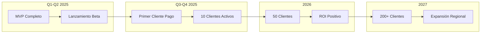
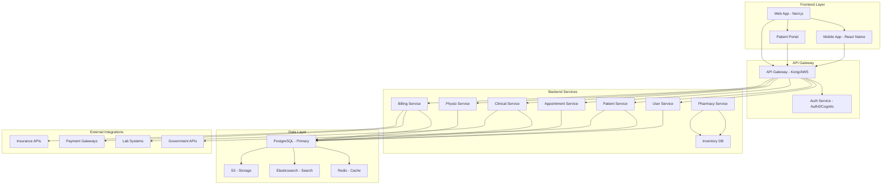

# Plan Estratégico de Desarrollo - MediCore ERP

## Visión y Dirección Estratégica

**Documento Confidencial**  
**Versión:** 1.0  
**Fecha:** Enero 2025  
**Audience:** Junta Directiva, CEO, CTO, Inversores

---

## Resumen Ejecutivo

MediCore ERP representa una oportunidad estratégica para transformar la gestión hospitalaria mediante tecnología moderna, escalable y alineada con las mejores prácticas de la industria de la salud. Este documento establece la visión a largo plazo, los objetivos estratégicos y el roadmap de implementación para los próximos 24 meses.

### Situación Actual

El proyecto se encuentra en una fase avanzada de desarrollo con las siguientes características:

| Indicador | Estado Actual |
|-----------|---------------|
| **Stack Tecnológico** | Next.js 14, TypeScript, Supabase |
| **Módulos Funcionales** | Pacientes, Citas, HCE, Fisioterapia, Farmacia, Laboratorio, Facturación |
| **Arquitectura** | Cloud-native, Serverless-ready |
| **Estado del Proyecto** | Desarrollo activo, pruebas funcionales |

### Oportunidad de Mercado

- **Mercado objetivo**: Clínicas y hospitales pequeños/medianos en mercados hispanohablantes
- **Tamaño de mercado**: USD 15-20 mil millones anuales
- **Crecimiento proyectado**: 12-15% CAGR para sistemas HCE
- **Ventaja competitiva**: Modernidad del stack, costo de propiedad, experiencia de usuario

---

## 1. Visión y Misión

### 1.1 Visión

"Ser el sistema de gestión hospitalaria más adoptado en América Latina, democratizando el acceso a tecnología de clase mundial para instituciones de salud de todos los tamaños."

### 1.2 Misión

"Desarrollar y entregar soluciones tecnológicas que simplifiquen la operación de instituciones de salud, mejoren la calidad de atención al paciente y generen valor measurable para nuestros clientes."

### 1.3 Valores Corporativos

| Valor | Descripción | Aplicación en Producto |
|-------|-------------|------------------------|
| **Excelencia Clínica** | Priorizar la seguridad del paciente | Validaciones estrictas, alertas de seguridad |
| **Simplicidad** | Interfaces intuitivas | UX research, testing con usuarios reales |
| **Confiabilidad** | 99.9% uptime SLA | Monitoreo proactivo, backups automatizados |
| **Escalabilidad** | Crecimiento sin degradación | Arquitectura cloud-native, microservices-ready |
| **Seguridad** | Protección de datos sensibles | Encriptación, auditorías, compliance |

---

## 2. Análisis Estratégico

### 2.1 Análisis FODA

#### Fortalezas

- **Stack tecnológico moderno**: Next.js 14, TypeScript, Supabase
- **Arquitectura escalable**: Serverless-ready, base de datos PostgreSQL
- **Experiencia de usuario**: Interfaces modernas, React components reutilizables
- **Costo de desarrollo**: Reducción de deuda técnica por estándares modernos
- **Módulos integrados**: Todos los departamentos conectados

#### Oportunidades

- **Digitalización de salud post-pandemia**: Aumento de demanda por sistemas digitales
- **Telemedicina**: Integración natural como módulo adicional
- **Inteligencia Artificial**: Oportunidades en diagnóstico asistido
- **Mercado hispanohablante**: Gran demanda, poca competencia local
- **Modelos SaaS**: Ingresos recurrentes escalables

#### Debilidades

- **Producto en desarrollo**: Falta de producción en vivo
- **Equipo pequeño**: Capacidad de desarrollo limitada
- **Sin casos de éxito documentados**: Necesita referencias de clientes
- **Dependencia de Supabase**: Vendor lock-in parcial

#### Amenazas

- **Competidores establecidos**: Softmedical, Siigo, sistemas legacy
- **Cambios regulatorios**: Normativas de datos de salud
- **Competencia de giants**: Google, Amazon entrando en healthcare
- **Costo de adquisición**: CAC alto en sector salud

### 2.2 Análisis Competitivo

| Competidor | Fortalezas | Debilidades | MediCore Advantage |
|------------|------------|-------------|-------------------|
| **Softmedical** | Establecido, fiturizado | Legacy, UI anticuada | Modernidad, UX |
| **Siigo** | Contabilidad integrada | No especializado salud | Especialización |
| **Sistemas Legacy** | Confiabilidad probada | Obsoletos, costosos | Cloud-native, scalable |
| **Epic/Cerner** | Enterprise features | Excesivo para SMB | Asequible, simple |

### 2.3 Propuesta de Valor Diferenciada

1. **Para clínicas pequeñas**: Acceso a tecnología enterprise a precio SMB
2. **Para médicos**: Experiencia de usuario superior, reducción de carga administrativa
3. **Para administradores**: Dashboard con métricas en tiempo real, reducción de costos operativos
4. **Para pacientes**: Portal de autoservicio, comunicación digital

---

## 3. Objetivos Estratégicos 2025-2027

### 3.1 Objetivos de Producto



### 3.2 Métricas Clave (KPIs)

| Métrica | 2025 | 2026 | 2027 |
|---------|------|------|------|
| **Clientes activos** | 10 | 50 | 200 |
| **MRR** | $5K | $50K | $250K |
| **Churn rate** | <15% | <10% | <5% |
| **NPS** | >40 | >50 | >60 |
| **Uptime** | 99.5% | 99.9% | 99.95% |
| **Time to value** | <7 días | <3 días | <1 día |

### 3.3 Objetivos de Ingeniería

| Objetivo | 2025 | 2026 | 2027 |
|----------|------|------|------|
| **Cobertura de tests** | 70% | 85% | 95% |
| **Debt técnico** | <10% | <5% | <2% |
| **Automatización CI/CD** | 100% | 100% | 100% |
| **Documentación** | 80% | 95% | 100% |
| **Security audit** | Anual | Semestral | Trimestral |

---

## 4. Roadmap de Producto

### 4.1 Fase 1: Foundation (Q1-Q2 2025)

**Objetivo**: Completar MVP y primeros clientes

#### Entregables Principales

| Módulo | Prioridad | Esfuerzo | Estado |
|--------|-----------|----------|--------|
| Pacientes | Crítica | Alto | ✅ Completo |
| Citas | Crítica | Medio | ✅ Completo |
| HCE SOAP | Crítica | Alto | ✅ Completo |
| Fisioterapia | Alta | Alto | ✅ Completo |
| Farmacia | Alta | Medio | ⚠️ Parcial |
| Laboratorio | Media | Medio | ⚠️ Parcial |
| Facturación | Alta | Medio | ⚠️ Parcial |
| Autenticación | Crítica | Bajo | ✅ Completo |

#### Métricas de Éxito

- [ ] 3+ clientes en producción
- [ ] 0 bloqueadores críticos
- [ ] Tiempo de onboarding <7 días
- [ ] NPS >30

### 4.2 Fase 2: Growth (Q3-Q4 2025)

**Objetivo**: Escalar operaciones y agregar features de alto valor

#### Features Planificados

| Feature | Valor para Cliente | Complejidad |
|---------|-------------------|-------------|
| **Portal del Paciente** | Autoservicio, reducción de llamadas | Alta |
| **Reportes Avanzados** | Analytics, dashboards personalizados | Media |
| **Integración Bancaria** | Pagos automáticos, conciliación | Alta |
| **API Pública** | Integraciones con terceros | Alta |
| **App Móvil** | Acceso móvil para médicos | Muy Alta |
| **Templates Personalizables** | Adaptación por especialidad | Media |

#### Expansión de Módulos

```
Planificación de Expansión:

┌─────────────────────────────────────────────────────────────┐
│  EXPANSIÓN 2025                                             │
├─────────────────────────────────────────────────────────────┤
│                                                             │
│  Q3 2025:                                                   │
│  ├── Portal del Paciente (APP + Web)                       │
│  ├── Mejoras en Facturación                                │
│  └── API Pública v1                                         │
│                                                             │
│  Q4 2025:                                                   │
│  ├── App Móvil para Médicos                                │
│  ├── Reportes y Analytics                                  │
│  └── Integración Bancaria                                  │
│                                                             │
└─────────────────────────────────────────────────────────────┘
```

### 4.3 Fase 3: Scale (2026)

**Objetivo**: Consolidar mercado y preparar expansión

#### Iniciativas Estratégicas

| Iniciativa | Inversión Estimada | Retorno Esperado |
|------------|-------------------|------------------|
| **Telemedicina** | $50K | +30% MRR |
| **IA Asistida** | $100K | +50% MRR, diferenciador |
| **Marketplace** | $30K | +20% MRR |
| **Multi-tenant** | $40K | Escalabilidad 10x |
| **Internacionalización** | $25K | Expansión a nuevos mercados |

#### Telemedicina

```typescript
// Telemedicine Module - Requirements

interface TelemedicineSession {
  id: string;
  patientId: string;
  doctorId: string;
  scheduledTime: Date;
  duration: number; // minutos
  type: 'video' | 'audio' | 'chat';
  status: 'scheduled' | 'in_progress' | 'completed' | 'cancelled';
  meetingUrl: string;
  recordingUrl?: string;
  prescription?: Prescription;
}
```

#### Inteligencia Artificial

| Caso de Uso | Impacto | Dificultad |
|-------------|---------|------------|
| **Transcripción de notas** | Alta | Media |
| **Coding ICD-10 automático** | Alta | Alta |
| **Predicción de citas no-show** | Media | Media |
| **Alertas de interacciones** | Alta | Alta |
| **Chatbot de triaje** | Alta | Muy Alta |

### 4.4 Fase 4: Expansion (2027)

**Objetivo**: Liderazgo regional

#### Mercados Objetivo

| Mercado | Potencial | Timing | Estrategia |
|---------|-----------|--------|------------|
| **México** | Muy Alto | Q1 2027 | Partner local |
| **Colombia** | Alto | Q2 2027 | Directo + Partner |
| **Perú** | Medio | Q3 2027 | Partner |
| **Argentina** | Medio | Q4 2027 | Partner |
| **España** | Bajo | 2028+ | Partner estratégico |

---

## 5. Arquitectura Técnica

### 5.1 Arquitectura Actual

```
┌─────────────────────────────────────────────────────────────────┐
│                      MEDICORE ERP - ARQUITECTURA                │
├─────────────────────────────────────────────────────────────────┤
│                                                                 │
│  ┌─────────────┐    ┌─────────────┐    ┌─────────────┐         │
│  │   Frontend  │    │   Backend   │    │   Database  │         │
│  │  Next.js 14 │◄──►│  API Routes │◄──►│  Supabase    │         │
│  │  React 18   │    │  TypeScript │    │  PostgreSQL │         │
│  └─────────────┘    └─────────────┘    └─────────────┘         │
│         │                                    │                  │
│         │                                    │                  │
│  ┌──────▼─────────────────────────┐    ┌─────▼──────┐          │
│  │      CDN & Static Assets       │    │   Storage  │          │
│  │      Vercel/Netlify            │    │   S3       │          │
│  └───────────────────────────────┘    └────────────┘          │
│                                                                 │
│  ┌─────────────────────────────────────────────────────────┐   │
│  │                    AUTENTICACIÓN                         │   │
│  │              Supabase Auth (JWT)                         │   │
│  └─────────────────────────────────────────────────────────┘   │
│                                                                 │
│  ┌─────────────────────────────────────────────────────────┐   │
│  │                    SERVICIOS EXTERNOS                    │   │
│  │  • Email (SendGrid/Resend)  • SMS (Twilio)              │   │
│  │  • Pagos (Stripe)           • Logs (Datadog)            │   │
│  └─────────────────────────────────────────────────────────┘   │
│                                                                 │
└─────────────────────────────────────────────────────────────────┘
```

### 5.2 Arquitectura Objetivo (2027)



### 5.3 Stack Tecnológico Objetivo

| Capa | Tecnología Actual | Tecnología Objetivo | Razón |
|------|-------------------|---------------------|-------|
| **Frontend** | Next.js 14 | Next.js 15+ | Mejores features |
| **Mobile** | No disponible | React Native | Un solo codebase |
| **Backend** | Next.js API | Node.js/NestJS | Mayor control |
| **Database** | Supabase | Supabase + read replicas | Escalabilidad |
| **Cache** | No disponible | Redis | Performance |
| **Search** | Postgres | Elasticsearch | Búsqueda avanzada |
| **Auth** | Supabase Auth | Auth0/Cognito | Enterprise features |
| **Infra** | Vercel/Netlify | AWS/Azure | Multi-cloud |
| **Monitoring** | No disponible | Datadog/NewRelic | Observability |
| **CI/CD** | GitHub Actions | GitHub Actions + ArgoCD | DevOps maduro |

---

## 6. Modelo de Negocio

### 6.1 Pricing Strategy

#### Modelo SaaS por Suscripción

| Plan | Precio/Mes | Usuarios | Features |
|------|------------|----------|----------|
| **Starter** | $99 | 5 | Módulos básicos |
| **Professional** | $299 | 15 | Todos los módulos |
| **Enterprise** | $799 | Ilimitado | +Custom features |
| **Custom** |协商 |协商 | On-premise option |

#### Estructura de Ingresos

```typescript
// Revenue Model
const revenueStreams = [
  {
    name: "Suscripción mensual",
    percentage: 70,
    growth: "MRR",
    target: "$250K para 2027"
  },
  {
    name: "Implementación",
    percentage: 15,
    growth: "One-time",
    target: "$2K-5K por cliente"
  },
  {
    name: "Training",
    percentage: 10,
    growth: "Servicios",
    target: "$500-1K por cliente"
  },
  {
    name: "Custom features",
    percentage: 5,
    growth: "Professional services",
    target: "Por proyecto"
  }
];
```

### 6.2 unit Economics

| Métrica | Año 1 | Año 2 | Año 3 |
|---------|-------|-------|-------|
| **MRR/Cliente** | $150 | $175 | $200 |
| **CAC** | $500 | $400 | $300 |
| **LTV** | $1,800 | $2,100 | $2,400 |
| **LTV:CAC** | 3.6x | 5.25x | 8x |
| **Gross Margin** | 70% | 75% | 80% |
| **Payback Period** | 4 meses | 3 meses | 2 meses |

### 6.3 Proyección Financiera

| Concepto | 2025 | 2026 | 2027 |
|----------|------|------|------|
| **Ingresos** | $60K | $600K | $3M |
| **Costos** | $120K | $400K | $1.2M |
| **Gross Profit** | -$60K | $200K | $1.8M |
| **Net Income** | -$150K | -$50K | $500K |
| **Clientes** | 10 | 50 | 200 |
| **Equipo** | 3 | 8 | 15 |

---

## 7. Estrategia de Marketing y Ventas

### 7.1 Go-to-Market Strategy

#### Fase 1: Beta Privada (Q1-Q2 2025)

| Canal | Inversión | Objetivo |
|-------|-----------|----------|
| **Redes profesionales** | $500 | 50 leads |
| **Cold outreach** | $200 | 20 demos |
| **Referrals** | $0 | 3 clientes |
| **Webinars** | $300 | 100 registros |

#### Fase 2: Lanzamiento Público (Q3 2025)

| Canal | Inversión | Objetivo |
|-------|-----------|----------|
| **SEO/Content** | $1,000/mes | 5K visitas/mes |
| **Paid ads** | $2,000/mes | 500 leads/mes |
| **Partners** | $1,500/mes | 2 partners |
| **Eventos** | $3,000/evento | 50 contactos |

### 7.2 Sales Funnel

```
┌─────────────────────────────────────────────────────────────────┐
│                    FUNNEL DE VENTAS                             │
├─────────────────────────────────────────────────────────────────┤
│                                                                 │
│  AWARENESS                    CONSIDERATION                   │
│  ─────────                    ─────────────                   │
│  Blog Posts            ──►    Demo Request                     │
│  Webinars              ──►    Free Trial                       │
│  Social Media          ──►    Case Studies                     │
│  SEO                   ──►    Pricing Page                     │
│                                                                 │
│                          DECISION                              │
│                          ────────                              │
│                          Proposal                              │
│                          Negotiation                           │
│                          Contract                              │
│                                                                 │
│  Métricas:                                                      │
│  • Visitors → Demo: 2%                                          │
│  • Demo → Trial: 40%                                            │
│  • Trial → Paid: 25%                                            │
│  • Overall Conversion: 0.2%                                     │
│                                                                 │
└─────────────────────────────────────────────────────────────────┘
```

---

## 8. Operaciones y Equipo

### 8.1 Estructura de Equipo Objetivo

| Rol | 2025 | 2026 | 2027 |
|-----|------|------|------|
| **CEO/Founder** | 1 | 1 | 1 |
| **CTO** | 1 | 1 | 1 |
| **Lead Developer** | 1 | 2 | 3 |
| **Developers** | 2 | 4 | 8 |
| **Designer UX** | 0 | 1 | 1 |
| **DevOps** | 0 | 1 | 2 |
| **Sales** | 0 | 1 | 2 |
| **Success Manager** | 0 | 1 | 2 |
| **Support** | 1 | 2 | 4 |
| **Total** | 6 | 13 | 24 |

### 8.2 Hiring Plan

#### Prioridades de Hiring 2025

| Prioridad | Rol | Timing | Razón |
|-----------|-----|--------|-------|
| 1 | DevOps | Q2 | Escalabilidad |
| 2 | Senior Dev | Q2 | Tech debt |
| 3 | UX Designer | Q3 | Product-market fit |
| 4 | Sales | Q3 | Revenue growth |
| 5 | Support | Q4 | Customer success |

### 8.3 Cultura Organizacional

#### Valores del Equipo

1. **Cliente primero**: Cada decisión evaluada por impacto en cliente
2. ** ownership**: Cada persona responsable de su área
3. **Iteración rápida**: Ship fast, learn fast
4. **Transparencia**: Información abierta internamente
5. **Work-life balance**: Sostenibilidad a largo plazo

---

## 9. Gestión de Riesgos

### 9.1 Matriz de Riesgos

| Riesgo | Probabilidad | Impacto | Mitigación |
|--------|--------------|---------|------------|
| **Competidor grande entra** | Media | Alto | Diferenciación en UX y especialización |
| **Retraso en desarrollo** | Alta | Medio | MVP features mínimos, scope control |
| **Pérdida de key people** | Media | Alto | Documentación, knowledge sharing |
| **Cambio regulatorio** | Baja | Alto | Compliance flexible, legal advisor |
| **Problema de seguridad** | Baja | Muy Alto | Security audits, penetration testing |
| **Cash flow problems** | Media | Alto | Fundraising proactivo, burn control |
| **Churn alto** | Media | Medio | Customer success, NPS monitoring |

### 9.2 Plan de Contingencia

| Escenario | Trigger | Acción |
|-----------|---------|--------|
| **Burn rate demasiado alto** | Cash < 6 meses | Reducir hiring, focus en revenue |
| **Churn >20%** | 2 meses consecutivos | Investigar causas, mejorar producto |
| **Security breach** | Cualquier incidente | Protocolo de comunicación, forensics |
| **Key departure** | Demisión de C-level | Board succession plan |

---

## 10. Métricas Operativas

### 10.1 Dashboard Ejecutivo

```typescript
// Executive Dashboard - Key Metrics
const executiveMetrics = {
  // Revenue Metrics
  mrr: { current: 5000, target: 500000, unit: 'USD' },
  arr: { current: 60000, target: 6000000, unit: 'USD' },
  netRevenueRetention: { current: 0, target: 110, unit: '%' },
  grossMargin: { current: 70, target: 80, unit: '%' },
  
  // Customer Metrics
  customers: { current: 10, target: 200, unit: 'count' },
  arpu: { current: 500, target: 1250, unit: 'USD' },
  churnRate: { current: 15, target: 5, unit: '%' },
  nps: { current: 30, target: 60, unit: 'score' },
  
  // Product Metrics
  uptime: { current: 99.5, target: 99.95, unit: '%' },
  pageLoadTime: { current: 2.5, target: 1.5, unit: 'seconds' },
  featureAdoption: { current: 40, target: 70, unit: '%' },
  
  // Team Metrics
  teamSize: { current: 6, target: 24, unit: 'count' },
  velocity: { current: 20, target: 40, unit: 'story_points' },
  timeToHire: { current: 60, target: 30, unit: 'days' }
};
```

### 10.2Reporting Schedule

| Report | Frecuencia | Audiencia | Contenido |
|--------|------------|-----------|-----------|
| **Daily Standup** | Diaria | Engineering | Blockers, progress |
| **Weekly OKR Review** | Semanal | Leadership | Métricas OKRs |
| **Monthly Board Report** | Mensual | Board | Financials, KPIs |
| **Quarterly Business Review** | Trimestral | Board + Team | Strategic review |
| **Annual Planning** | Anual | Todo el equipo | Planning next year |

---

## 11. Recomendaciones de Implementación

### 11.1 Acciones Inmediatas (0-30 días)

| # | Acción | Responsable | Prioridad |
|---|--------|-------------|-----------|
| 1 | Completar módulos pendientes (Farmacia, Lab, Facturación) | Tech | Crítica |
| 2 | Implementar logging y monitoreo | DevOps | Alta |
| 3 | Security audit básico | Tech | Alta |
| 4 | Documentar API | Tech | Media |
| 5 | Crear landing page | Marketing | Media |
| 6 | Preparar materials de ventas | Sales | Media |
| 7 | Setup analytics (Mixpanel/Amplitude) | Product | Media |
| 8 | Crear instancias de staging | DevOps | Alta |

### 11.2 Acciones de Corto Plazo (30-90 días)

| # | Acción | Responsable | Prioridad |
|---|--------|-------------|-----------|
| 1 | Lanzar beta privada | CEO | Crítica |
| 2 | Implementar feedback loop con beta users | Product | Alta |
| 3 | Optimizar performance (Core Web Vitals) | Tech | Alta |
| 4 | Crear documentation portal | Tech | Media |
| 5 | Setup automated testing | Tech | Alta |
| 6 | Implementar feature flags | Tech | Media |
| 7 | Preparar caso de estudio con primer cliente | Success | Media |
| 8 | Iniciar outreach a potenciales clientes | Sales | Alta |

### 11.3 Acciones de Mediano Plazo (90-180 días)

| # | Acción | Responsable | Prioridad |
|---|--------|-------------|-----------|
| 1 | Lanzamiento público | All | Crítica |
| 2 | Implementar Portal del Paciente | Tech | Alta |
| 3 | Setup customer success process | Success | Alta |
| 4 | Implementar analytics de uso | Product | Media |
| 5 | Crear partnership program | Business | Media |
| 6 | Optimizar pricing basado en datos | CEO/Product | Media |
| 7 | Implementar CI/CD completo | DevOps | Alta |
| 8 | Preparar raise (si necesario) | CEO | Alta |

---

## 12. Conclusiones

### 12.1 Puntos Clave

1. **Oportunidad real**: MediCore tiene potencial significativo en el mercado de sistemas HCE para SMBs
2. **Timing favorable**: Digitalización acelerada post-pandemia
3. **Stack moderno**: Ventaja técnica sobre competidores legacy
4. **Ejecución es clave**: El plan es ambicioso pero alcanzable con el equipo correcto

### 12.2 Factores Críticos de Éxito

| Factor | Descripción | Métrica |
|--------|-------------|---------|
| **Time to market** | Lanzar rápido para capturar mercado | <6 meses |
| **Product quality** | UX superior para diferenciarse | NPS >50 |
| **Customer success** | Retener y expandir clientes | Churn <10% |
| **Execution speed** | Iterar rápidamente | 2+ releases/semana |
| **Team quality** | Contratar los mejores | Engineering quality score |

### 12.3 Próximos Pasos

1. **Revisar y aprobar este plan** (1 semana)
2. **Alinear equipo con OKRs** (2 semanas)
3. **Iniciar hiring del roadmap** (inmediato)
4. **Kickoff de ejecución** (2 semanas)
5. **Monthly check-ins con board** (mensual)

---

**Documento preparado por:** Equipo de Liderazgo MediCore ERP  
**Próxima revisión:** Abril 2025  
**Versión:** 1.0 - Borrador para aprobación

---

## Anexo A: Glosario de Términos

| Término | Definición |
|---------|------------|
| **MRR** | Monthly Recurring Revenue - Ingresos recurrentes mensuales |
| **ARR** | Annual Recurring Revenue - Ingresos recurrentes anuales |
| **CAC** | Customer Acquisition Cost - Costo de adquisición de cliente |
| **LTV** | Lifetime Value - Valor del cliente a lo largo de su vida |
| **Churn** | Tasa de abandono de clientes |
| **NPS** | Net Promoter Score - Índice de recomendación |
| **ARPU** | Average Revenue Per User - Ingreso promedio por usuario |
| **SaaS** | Software as a Service - Software como servicio |
| **MVP** | Minimum Viable Product - Producto mínimo viable |
| **SMB** | Small and Medium Business - Pequeña y mediana empresa |

## Anexo B: Comparación de Competidores

| Feature | MediCore | Softmedical | Siigo | Sistema Legacy |
|---------|----------|-------------|-------|----------------|
| **Cloud-native** | ✅ | ❌ | ✅ | ❌ |
| **Modern UI** | ✅ | ❌ | ⚠️ | ❌ |
| **Mobile app** | ⏳ | ❌ | ❌ | ❌ |
| **API** | ⏳ | ✅ | ✅ | ❌ |
| **Multi-tenant** | ✅ | ❌ | ✅ | ❌ |
| **Real-time** | ✅ | ⚠️ | ⚠️ | ❌ |
| **Pricing** | $$ | $$$$ | $$$ | $$$$ |
| **Setup time** | 1 semana | 1 mes | 2 semanas | 3 meses |

Leyenda: ✅ Sí, ❌ No, ⏳ En desarrollo, ⚠️ Parcial, $$$ Costo relativo

---

**FIN DEL DOCUMENTO**
