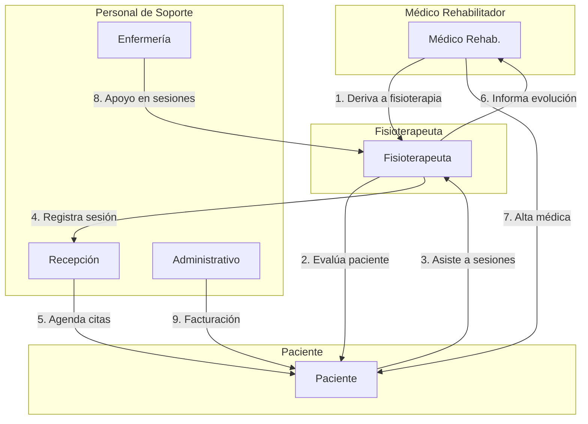
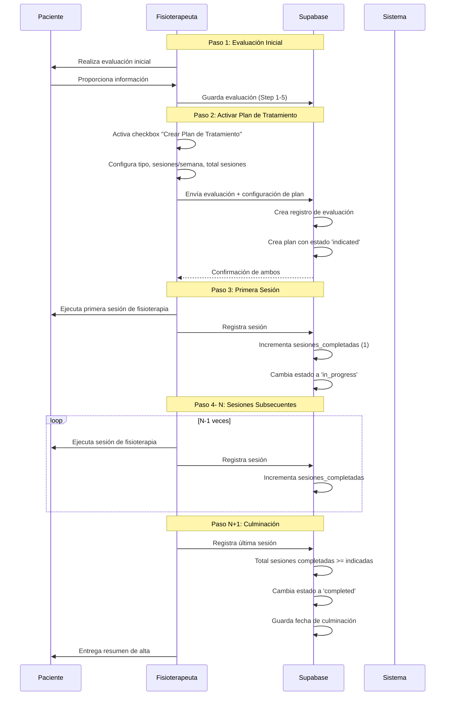

# Plan de Implementación: Integración de Evaluación y Plan de Tratamiento

## 1. Resumen Ejecutivo

Este documento describe el plan para integrar la **Evaluación Inicial de Fisioterapia** con el **Plan de Tratamiento**, permitiendo al fisioterapeuta crear un plan de tratamiento directamente desde la evaluación con datos pre-configurados. También se define la arquitectura de roles del personal médico involucrados en el proceso.

### Objetivos Principales

1. **Integración fluida**: Crear plan de tratamiento desde evaluación en un solo flujo
2. **Datos pre-llenados**: Diagnostic objectives, limitaciones funcionales, objetivos a corto/largo plazo
3. **Workflow de estados**: Indicado → En Proceso → Culminado
4. **Roles definidos**: Definir personal médico involucrado y sus permisos

---

## 2. Análisis de la Situación Actual

### 2.1 Estado Actual del Código

**Evaluación (`evaluation/new/page.tsx`)**
- Step 5: "Diagnóstico y Plan de Tratamiento" (líneas 931-1084)
- Campos actuales: `clinical_diagnosis`, `icd10_codes`, `functional_limitations`, `short_term_goals`, `long_term_goals`
- No tiene opción para crear plan de tratamiento

**Plan (`plans/new/page.tsx`)**
- Carga pacientes y evaluaciones existentes
- Permite seleccionar evaluación y pre-llenar `clinical_objective` (líneas 93-104)
- No recibe datos automáticos de la evaluación

**Planes (`plans/page.tsx`)**
- Filtros actuales: `active`, `completed`, `paused`, `cancelled`
- No muestra estado "indicated"

### 2.2 Gap Identificado

```
Situación Actual:
┌─────────────────────┐     ┌─────────────────────┐
│  Evaluación         │     │  Plan de Tratamiento│
│  (standalone)       │     │  (standalone)       │
│                     │     │                     │
│  - Diagnóstico      │     │  - Seleccionar      │
│  - Objetivos        │     │    paciente         │
│  - Consentimiento   │     │  - Seleccionar      │
│                     │     │    evaluación       │
└─────────────────────┘     │  - Configurar plan  │
                            └─────────────────────┘

Situación Objetivo:
┌─────────────────────┐     ┌─────────────────────┐
│  Evaluación         │────►│  Plan de Tratamiento│
│  + Activar Plan     │     │  (pre-llenado)      │
│                     │     │                     │
│  - Diagnóstico      │     │  - Datos heredados  │
│  - Objetivos        │     │  - Configuración    │
│  - Consentimiento   │     │  - Sesiones         │
│  + Configuración    │     │                     │
│    de Plan          │     └─────────────────────┘
└─────────────────────┘
```

---

## 3. Arquitectura de Roles del Personal Médico

### 3.1 Roles y Responsabilidades en el Flujo de Fisioterapia



### 3.2 Matriz de Roles y Permisos

| Rol | Evaluación | Plan de Tratamiento | Sesiones | Alta/Culminación | Derivación |
|-----|------------|---------------------|----------|------------------|------------|
| **Médico Rehabilitador** | Leer | Indicar | No aplica | Autorizar alta | Crear derivación |
| **Fisioterapeuta** | Crear/Leer | Crear/Editar | Registrar sesiones | Proponer culminación | No aplica |
| **Fisioterapeuta Senior** | Crear/Leer/Editar | Crear/Editar/Eliminar | Gestionar todas | Autorizar culminación | Crear derivación |
| **Enfermería** | Leer | No aplica | Apoyar sesiones | No aplica | No aplica |
| **Recepción** | No aplica | No aplica | Agenda de citas | No aplica | No aplica |
| **Administrativo** | No aplica | Leer reportes | Reportes | Reportes | No aplica |

### 3.3 Descripción Detallada de Roles

#### 3.3.1 Médico Rehabilitador

```typescript
interface MedicoRehabilitador {
  rol: 'medico_rehab';
  especialidad: 'Medicina Física y Rehabilitación';
  
  responsabilidades: [
    'Evaluar paciente y determinar necesidad de fisioterapia',
    'Crear derivación a fisioterapia',
    'Definir objetivos terapéuticos generales',
    'Revisar evolución del paciente',
    'Autorizar alta médica',
    'Prescribir número estimado de sesiones'
  ];
  
  permisos: [
    'patients:read',
    'physio:read',           // Ver evaluaciones
    'physio:indicate',       // Indicar planes de tratamiento
    'referrals:create',      // Crear derivaciones
    'referrals:read',
    'clinical_records:read',
    'clinical_records:write' // Notas de evolución médica
  ];
}
```

#### 3.3.2 Fisioterapeuta

```typescript
interface Fisioterapeuta {
  rol: 'fisioterapeuta';
  especialidad: 'Fisioterapia';
  
  responsabilidades: [
    'Realizar evaluación inicial',
    'Crear plan de tratamiento desde evaluación',
    'Ejecutar sesiones de fisioterapia',
    'Registrar evolución en cada sesión',
    'Actualizar estado del plan',
    'Proponer culminación del tratamiento'
  ];
  
  permisos: [
    'patients:read',
    'patients:write',
    'physio:create',        // Crear evaluaciones
    'physio:read',
    'physio:write',
    'plans:create',         // Crear planes
    'plans:read',
    'plans:write',          // Editar planes
    'sessions:create',      // Registrar sesiones
    'sessions:read',
    'sessions:write'
  ];
}
```

#### 3.3.3 Fisioterapeuta Senior

```typescript
interface FisioterapeutaSenior {
  rol: 'fisioterapeuta_senior';
  especialidad: 'Fisioterapia';
  
  responsabilidades: [
    'Todas las del fisioterapeuta',
    'Supervisar casos complejos',
    'Autorizar cambios significativos en planes',
    'Aprobar culminación de tratamientos',
    'Capacitar fisioterapeutas junior'
  ];
  
  permisos: [
    'patients:read',
    'patients:write',
    'physio:create',
    'physio:read',
    'physio:write',
    'physio:delete',        // Eliminar evaluaciones
    'plans:create',
    'plans:read',
    'plans:write',
    'plans:delete',         // Eliminar planes
    'plans:finalize',       // Culminar planes
    'sessions:create',
    'sessions:read',
    'sessions:write',
    'sessions:delete'
  ];
}
```

---

## 4. Plan de Implementación Técnica

### 4.1 Cambios en el Formulario de Evaluación

#### 4.1.1 Agregar Estado para Plan de Tratamiento

```typescript
// En el state del formulario (línea ~63)
const [formData, setFormData] = useState({
  // ... campos existentes ...
  
  // Nuevos campos para plan de tratamiento
  activate_treatment_plan: false,
  plan_type: 'rehabilitation' as const,
  sessions_per_week: 3,
  total_sessions_prescribed: 10,
  expected_end_date: '',
  clinical_objective: '',
  baseline_rom: '',
  baseline_functional_score: null as number | null,
});
```

#### 4.1.2Nueva Sección en Step 5: "Configuración de Plan de Tratamiento"

```tsx
{/* Nueva sección: Activar Plan de Tratamiento */}
<div className="border rounded-lg p-4 bg-blue-50 space-y-4">
  <div className="flex items-start gap-3">
    <input
      type="checkbox"
      checked={formData.activate_treatment_plan}
      onChange={(e) => handleCheckboxChange('activate_treatment_plan', e.target.checked)}
      className="mt-1 w-5 h-5 text-blue-600 rounded border-gray-300 focus:ring-blue-500"
    />
    <div>
      <p className="font-medium text-gray-900">Crear Plan de Tratamiento</p>
      <p className="text-sm text-gray-500">
        Al activar esta opción, se creará automáticamente un plan de tratamiento 
        con los datos de esta evaluación.
      </p>
    </div>
  </div>

  {/* Configuración del plan (solo si está activado) */}
  {formData.activate_treatment_plan && (
    <div className="grid grid-cols-1 md:grid-cols-2 gap-4 mt-4">
      <div>
        <label className="label mb-1.5">Tipo de Plan *</label>
        <select
          name="plan_type"
          value={formData.plan_type}
          onChange={handleChange}
          className="input"
          required={formData.activate_treatment_plan}
        >
          <option value="rehabilitation">Rehabilitación</option>
          <option value="maintenance">Mantenimiento</option>
          <option value="preventive">Preventivo</option>
          <option value="performance">Rendimiento</option>
        </select>
      </div>
      
      <div>
        <label className="label mb-1.5">Sesiones por semana *</label>
        <input
          type="number"
          name="sessions_per_week"
          value={formData.sessions_per_week}
          onChange={handleChange}
          min="1"
          max="7"
          className="input"
          required={formData.activate_treatment_plan}
        />
      </div>
      
      <div>
        <label className="label mb-1.5">Total de sesiones prescritas *</label>
        <input
          type="number"
          name="total_sessions_prescribed"
          value={formData.total_sessions_prescribed}
          onChange={handleChange}
          min="1"
          max="100"
          className="input"
          required={formData.activate_treatment_plan}
        />
      </div>
      
      <div>
        <label className="label mb-1.5">Fecha estimada de finalización</label>
        <input
          type="date"
          name="expected_end_date"
          value={formData.expected_end_date}
          onChange={handleChange}
          className="input"
        />
      </div>
      
      <div className="md:col-span-2">
        <label className="label mb-1.5">Objetivo clínico principal</label>
        <textarea
          name="clinical_objective"
          value={formData.clinical_objective || formData.clinical_diagnosis}
          onChange={handleChange}
          className="input min-h-[80px]"
          placeholder="Objetivo principal del tratamiento (se pre-llena con el diagnóstico)..."
        />
        <p className="text-xs text-gray-500 mt-1">
          Se pre-llena automáticamente con el diagnóstico clínico.
        </p>
      </div>
      
      <div>
        <label className="label mb-1.5">ROM basal (opcional)</label>
        <input
          type="text"
          name="baseline_rom"
          value={formData.baseline_rom}
          onChange={handleChange}
          className="input"
          placeholder="Ej: Flexión 90°, Extensión 0°"
        />
      </div>
      
      <div>
        <label className="label mb-1.5">Score funcional inicial</label>
        <input
          type="number"
          name="baseline_functional_score"
          value={formData.baseline_functional_score || ''}
          onChange={handleChange}
          className="input"
          placeholder="0-100"
        />
      </div>
    </div>
  )}
</div>
```

#### 4.1.3 Modificar handleSubmit para Crear Plan

```typescript
const handleSubmit = async (e: React.FormEvent) => {
  e.preventDefault();
  setSaving(true);
  setError(null);

  try {
    const { data: { user } } = await supabase.auth.getUser();
    if (!user) {
      throw new Error('Usuario no autenticado');
    }

    // 1. Crear la evaluación
    const { data: record, error: insertError } = await supabase
      .from('physio_medical_records')
      .insert({
        patient_id: formData.patient_id,
        therapist_id: user.id,
        // ... resto de campos de la evaluación ...
        clinical_diagnosis: formData.clinical_diagnosis,
        // ... otros campos ...
        status: 'active',
      })
      .select()
      .single();

    if (insertError) {
      throw new Error(insertError.message);
    }

    // 2. Si está activado, crear el plan de tratamiento
    let planId = null;
    if (formData.activate_treatment_plan) {
      const planData = {
        patient_id: formData.patient_id,
        medical_record_id: record.id,  // Vincular a la evaluación
        therapist_id: user.id,
        diagnosis_code: formData.icd10_codes?.split(',')[0] || null,
        diagnosis_description: formData.clinical_diagnosis,
        plan_type: formData.plan_type,
        clinical_objective: formData.clinical_objective || formData.clinical_diagnosis,
        start_date: new Date().toISOString().split('T')[0],
        expected_end_date: formData.expected_end_date || null,
        sessions_per_week: formData.sessions_per_week,
        total_sessions_prescribed: formData.total_sessions_prescribed,
        sessions_completed: 0,
        baseline_rom: formData.baseline_rom || null,
        baseline_functional_score: formData.baseline_functional_score,
        status: 'indicated',  // Estado inicial: INDICADO
        notes: formData.notes || null,
      };

      const { data: plan, error: planError } = await supabase
        .from('physio_treatment_plans')
        .insert(planData)
        .select()
        .single();

      if (planError) {
        console.error('Error al crear plan:', planError);
        // No fallar todo el proceso, solo warning
      } else {
        planId = plan.id;
      }
    }

    setSuccess(true);
    
    // Redireccionar según corresponda
    setTimeout(() => {
      if (planId) {
        router.push(`/dashboard/physiotherapy/plans/${planId}`);
      } else {
        router.push(`/dashboard/physiotherapy/evaluation/${record.id}`);
      }
    }, 2000);

  } catch (err) {
    setError(err instanceof Error ? err.message : 'Error al guardar');
  } finally {
    setSaving(false);
  }
};
```

### 4.2 Actualización de Tipos TypeScript

```typescript
// lib/types/physiotherapy.ts

// Actualizar el tipo PhysioTreatmentPlan para incluir nuevo estado
export interface PhysioTreatmentPlan {
  id: string;
  patient_id: string;
  medical_record_id?: string;  // Nuevo campo para vincular evaluación
  prescribing_doctor_id?: string;
  department_id?: string;
  diagnosis_code?: string;
  diagnosis_description?: string;
  plan_type: 'rehabilitation' | 'maintenance' | 'preventive' | 'performance';
  clinical_objective?: string;
  start_date: string;
  expected_end_date?: string;
  actual_end_date?: string;
  // Estados actualizados incluyendo 'indicated'
  status: 'indicated' | 'in_progress' | 'completed' | 'paused' | 'cancelled';
  sessions_per_week?: number;
  total_sessions_prescribed?: number;
  sessions_completed?: number;
  initial_assessment?: string;
  baseline_rom?: string;
  baseline_functional_score?: number;
  progress_notes?: string[];
  outcome_measures?: OutcomeMeasure[];
  notes?: string;
  created_at: string;
  updated_at: string;
}

// Labels para el nuevo estado
export const planStatusLabels: Record<string, string> = {
  indicated: 'Indicado',
  in_progress: 'En Proceso',
  completed: 'Culminado',
  paused: 'Pausado',
  cancelled: 'Cancelado',
};

export const planStatusColors: Record<string, string> = {
  indicated: 'bg-blue-100 text-blue-800',
  in_progress: 'bg-green-100 text-green-800',
  completed: 'bg-purple-100 text-purple-800',
  paused: 'bg-yellow-100 text-yellow-800',
  cancelled: 'bg-red-100 text-red-800',
};
```

### 4.3 Actualizar Lista de Planes

```typescript
// app/(dashboard)/dashboard/physiotherapy/plans/page.tsx

// Agregar nuevo estado al filtro
const statusLabels: Record<string, string> = {
  indicated: 'Indicado',
  in_progress: 'En Proceso',
  completed: 'Culminado',
  paused: 'Pausado',
  cancelled: 'Cancelado',
};

const statusColors: Record<string, string> = {
  indicated: 'bg-blue-100 text-blue-800',
  in_progress: 'bg-green-100 text-green-800',
  completed: 'bg-purple-100 text-purple-800',
  paused: 'bg-yellow-100 text-yellow-800',
  cancelled: 'bg-red-100 text-red-800',
};

// Modificar fetchPlans para incluir solo planes "indicados" como default
// O agregar una nueva vista/tab para "Planes Indicados"
```

### 4.4 Flujo de Sesiones y Cambio de Estado

```typescript
// app/api/physio/sessions/route.ts (nuevo endpoint)

import { createClient } from '@/lib/supabase/server';
import { NextRequest, NextResponse } from 'next/server';

export async function POST(request: NextRequest) {
  const supabase = createClient();
  
  try {
    const { data: { user } } = await supabase.auth.getUser();
    if (!user) {
      return NextResponse.json({ error: 'No autorizado' }, { status: 401 });
    }

    const body = await request.json();
    const {
      plan_id,
      patient_id,
      session_number,
      subjective,
      objective,
      analysis,
      plan,
      techniques_applied,
      pain_level,
      notes
    } = body;

    // 1. Crear la sesión
    const { data: session, error: sessionError } = await supabase
      .from('physio_sessions')
      .insert({
        plan_id,
        patient_id,
        therapist_id: user.id,
        session_number,
        session_date: new Date().toISOString(),
        session_time: new Date().toTimeString().split(' ')[0],
        duration_minutes: 45,
        is_initial_session: session_number === 1,
        is_reassessment: false,
        subjective,
        objective,
        analysis,
        plan,
        techniques_applied,
        pain_level,
        notes,
        status: 'completed',
      })
      .select()
      .single();

    if (sessionError) {
      throw sessionError;
    }

    // 2. Actualizar el plan: incrementar sesiones completadas
    // y cambiar estado de 'indicated' a 'in_progress'
    const { data: plan } = await supabase
      .from('physio_treatment_plans')
      .select('sessions_completed, total_sessions_prescribed, status')
      .eq('id', plan_id)
      .single();

    const newSessionsCompleted = (plan?.sessions_completed || 0) + 1;
    const newStatus = plan?.status === 'indicated' ? 'in_progress' : plan?.status;

    // 3. Verificar si todas las sesiones fueron completadas
    const isCompleted = newSessionsCompleted >= (plan?.total_sessions_prescribed || 0);

    await supabase
      .from('physio_treatment_plans')
      .update({
        sessions_completed: newSessionsCompleted,
        status: isCompleted ? 'completed' : newStatus,
        actual_end_date: isCompleted ? new Date().toISOString().split('T')[0] : null,
      })
      .eq('id', plan_id);

    return NextResponse.json({ session, planStatus: isCompleted ? 'completed' : newStatus });
    
  } catch (error) {
    console.error('Error creating session:', error);
    return NextResponse.json({ error: 'Error al crear sesión' }, { status: 500 });
  }
}
```

### 4.5 Migración de Base de Datos

```sql
-- Migration: Agregar campo medical_record_id a physio_treatment_plans

ALTER TABLE physio_treatment_plans 
ADD COLUMN IF NOT EXISTS medical_record_id UUID REFERENCES physio_medical_records(id) ON DELETE SET NULL;

-- Migration: Agregar nuevo estado 'indicated' a la tabla
-- El campo status ya existe, solo necesitamos asegurar que acepte el nuevo valor

-- Migration: Crear índice para mejorar rendimiento
CREATE INDEX IF NOT EXISTS idx_physio_treatment_plans_medical_record 
ON physio_treatment_plans(medical_record_id);

CREATE INDEX IF NOT EXISTS idx_physio_treatment_plans_status 
ON physio_treatment_plans(status);
```

---

## 5. Flujo de Usuario

### 5.1 Flujo Principal: Evaluación → Plan → Sesiones → Culminación



### 5.2 Interfaz de Usuario: Vista del Plan

```
┌─────────────────────────────────────────────────────────────────┐
│  PLAN DE TRATAMIENTO - FISIOTERAPIA                             │
├─────────────────────────────────────────────────────────────────┤
│                                                                 │
│  ┌─ ESTADO DEL PLAN ─────────────────────────────────────────┐ │
│  │                                                              │ │
│  │  [INDICADO] → [EN PROCESO] → [CULMINADO]                    │ │
│  │                                                              │ │
│  │  Estado actual: 🔵 Indicado                                 │ │
│  │  Progreso: 0 / 10 sesiones (0%)                             │ │
│  │                                                              │ │
│  └────────────────────────────────────────────────────────────┘ │
│                                                                 │
│  ┌─ INFORMACIÓN GENERAL ──────────────────────────────────────┐ │
│  │                                                              │ │
│  │  Tipo de Plan: Rehabilitación                               │ │
│  │  Paciente: Juan Pérez                                       │ │
│  │  DNI: 12345678                                              │ │
│  │  Fecha de Inicio: 27/01/2025                                │ │
│  │  Fecha Estimada de Culminación: 27/03/2025                  │ │
│  │                                                              │ │
│  └────────────────────────────────────────────────────────────┘ │
│                                                                 │
│  ┌─ OBJETIVOS DEL TRATAMIENTO ─────────────────────────────────┐ │
│  │                                                              │ │
│  │  Objetivo Principal:                                         │ │
│  │  Recuperar rango de movimiento completo de hombro derecho    │ │
│  │                                                              │ │
│  │  Objetivos a Corto Plazo:                                    │ │
│  │  • Reducir dolor a VAS 3                                     │ │
│  │  • Mejorar flexión a 120°                                    │ │
│  │                                                              │ │
│  │  Objetivos a Largo Plazo:                                    │ │
│  │  • Recuperar flexión a 180°                                  │ │
│  │  • Reintegrar a actividades deportivas                       │ │
│  │                                                              │ │
│  └────────────────────────────────────────────────────────────┘ │
│                                                                 │
│  ┌─ CONFIGURACIÓN DE SESIONES ─────────────────────────────────┐ │
│  │                                                              │ │
│  │  Sesiones por semana: 3                                      │ │
│  │  Total sesiones prescritas: 10                               │ │
│  │  Sesiones completadas: 0                                     │ │
│  │  Sesiones restantes: 10                                      │ │
│  │                                                              │ │
│  └────────────────────────────────────────────────────────────┘ │
│                                                                 │
│  ┌─ ACCIONES ──────────────────────────────────────────────────┐ │
│  │                                                              │ │
│  │  [Iniciar Primera Sesión]  [Ver Evaluación]  [Imprimir]      │ │
│  │                                                              │ │
│  └────────────────────────────────────────────────────────────┘ │
│                                                                 │
└─────────────────────────────────────────────────────────────────┘
```

### 5.3 Vista de Planes "Indicados" (Nueva funcionalidad)

```
┌─────────────────────────────────────────────────────────────────┐
│  PLANES DE TRATAMIENTO                                          │
├─────────────────────────────────────────────────────────────────┤
│                                                                 │
│  ┌─ FILTROS ──────────────────────────────────────────────────┐ │
│  │  [Buscar paciente...]  [Estado: Indicado ▼]  [ Filtrar ]   │ │
│  └────────────────────────────────────────────────────────────┘ │
│                                                                 │
│  ┌─ ESTADÍSTICAS ─────────────────────────────────────────────┐ │
│  │  ┌─────────┐ ┌─────────┐ ┌─────────┐ ┌─────────┐          │ │
│  │  │Indicados│ │En Proceso│ │Culminad.│ │ Pausados│          │ │
│  │  │    5    │ │    12   │ │    8    │ │    2    │          │ │
│  │  └─────────┘ └─────────┘ └─────────┘ └─────────┘          │ │
│  └────────────────────────────────────────────────────────────┘ │
│                                                                 │
│  ┌─ LISTA DE PLANES INDICADOS ─────────────────────────────────┐ │
│  │                                                              │ │
│  │  [ ] Juan Pérez - Rehabilitación Hombro (10 sesiones)       │ │
│  │     DNI: 12345678 | Indicado: 27/01/2025 | Dr. García       │ │
│  │     [Iniciar Primera Sesión]  [Ver Evaluación]              │ │
│  │                                                              │ │
│  │  [ ] María López - Mantenimiento Lumbar (15 sesiones)       │ │
│  │     DNI: 87654321 | Indicado: 26/01/2025 | Dra. Ruiz        │ │
│  │     [Iniciar Primera Sesión]  [Ver Evaluación]              │ │
│  │                                                              │ │
│  │  [ ] Carlos García - Preventivo Cervical (8 sesiones)       │ │
│  │     DNI: 11223344 | Indicado: 25/01/2025 | Dr. García       │ │
│  │     [Iniciar Primera Sesión]  [Ver Evaluación]              │ │
│  │                                                              │ │
│  └────────────────────────────────────────────────────────────┘ │
│                                                                 │
└─────────────────────────────────────────────────────────────────┘
```

---

## 6. Lista de Tareas de Implementación

### 6.1 Tareas Frontend

| # | Tarea | Complejidad | Prioridad |
|---|-------|-------------|-----------|
| 1 | Agregar estado `activate_treatment_plan` al formulario | Baja | Alta |
| 2 | Crear componente de configuración de plan | Media | Alta |
| 3 | Pre-llenar `clinical_objective` desde `clinical_diagnosis` | Baja | Alta |
| 4 | Modificar `handleSubmit` para crear plan | Media | Alta |
| 5 | Actualizar `planStatusLabels` y `statusColors` | Baja | Media |
| 6 | Actualizar lista de planes con nuevo estado | Baja | Media |
| 7 | Crear vista "Planes Indicados" | Media | Media |
| 8 | Crear componente de progreso del plan | Baja | Media |
| 9 | Agregar botón "Iniciar Primera Sesión" | Baja | Alta |
|10 | Actualizar tipos TypeScript | Baja | Alta |

### 6.2 Tareas Backend

| # | Tarea | Complejidad | Prioridad |
|---|-------|-------------|-----------|
| 1 | Crear migración de base de datos | Baja | Alta |
| 2 | Crear endpoint API para sesiones con cambio de estado | Media | Alta |
| 3 | Actualizar endpoint de planes para incluir `medical_record_id` | Baja | Media |
| 4 | Agregar función para calcular estado automático | Baja | Media |

### 6.3 Tareas de Testing

| # | Tarea | Complejidad | Prioridad |
|---|-------|-------------|-----------|
| 1 | Testing unitario del formulario | Media | Media |
| 2 | Testing de flujo completo evaluación→plan | Alta | Alta |
| 3 | Testing de cambio de estado automático | Media | Media |
| 4 | Testing E2E del workflow | Alta | Media |

### 6.4 Tareas de Documentación

| # | Tarea | Complejidad | Prioridad |
|---|-------|-------------|-----------|
| 1 | Actualizar manual de usuario | Baja | Media |
| 2 | Documentar nuevo workflow | Baja | Media |
| 3 | Actualizar diagrama de arquitectura | Baja | Baja |

---

## 7. Estimación de Esfuerzo

| Fase | Tareas | Esfuerzo Estimado |
|------|--------|-------------------|
| **Fase 1: Frontend** | Items 1-4 | 4-6 horas |
| **Fase 2: Backend** | Items 1-4 | 3-4 horas |
| **Fase 3: Integración** | Items 5-9 | 3-4 horas |
| **Fase 4: Testing** | Items 1-4 | 4-6 horas |
| **Fase 5: Documentación** | Items 1-3 | 2-3 horas |
| **Total** | | **16-23 horas** |

---

## 8. Consideraciones Adicionales

### 8.1 Manejo de Errores

- Si falla la creación del plan, la evaluación debe guardarse igual
- Mostrar warning pero no bloquear el guardado
- Permitir crear el plan posteriormente desde la evaluación guardada

### 8.2 Validaciones

- Requerir `total_sessions_prescribed > 0` si `activate_treatment_plan` está activo
- Validar que `expected_end_date` sea posterior a `start_date`
- Pre-llenar `clinical_objective` pero permitir edición

### 8.3 Retrocompatibilidad

- Planes existentes mantienen estado actual (no migrar automáticamente)
- Solo nuevos planes creados desde evaluación tendrán estado "indicated"
- Permisos existentes no requieren cambios

### 8.4 Mejoras Futuras

- **Programación automática**: Calcular fechas de sesiones automáticamente
- **Recordatorios**: Notificar al paciente de citas programadas
- **Templates**: Guardar configuraciones de plan como plantillas
- **Reportes**: Generar reportes de progreso automáticos

---

## 9. Conclusiones y Próximos Pasos

### 9.1 Resumen de Cambios

1. **Evaluación**: Nueva sección para activar y configurar plan de tratamiento
2. **Plan**: Nuevo estado "indicated", vinculación con evaluación
3. **Sesiones**: Cambio automático de estado al registrar primera sesión
4. **Roles**: Matriz de permisos definida para personal médico

### 9.2 Criterios de Éxito

- [ ] Fisioterapeuta puede crear plan desde evaluación en un solo flujo
- [ ] Datos se pre-llenan correctamente desde evaluación
- [ ] Estado cambia automáticamente: indicated → in_progress → completed
- [ ] Lista de planes muestra filtros correctos
- [ ] Tests unitarios pasan con cobertura >80%

### 9.3 Próximos Pasos Inmediatos

1. Revisar y aprobar este plan
2. Crear rama feature en git
3. Implementar cambios de frontend (Fase 1)
4. Implementar cambios de backend (Fase 2)
5. Testing y QA
6. Deploy a staging
7. Deploy a producción

---

## 10. Estado de Implementación (Enero 2025)

### 10.1 Componentes Completados ✅

| Componente | Estado | Archivo |
|------------|--------|---------|
| Tipos TypeScript | ✅ Completo | `lib/types/physiotherapy.ts` |
| Estado "indicated" en PhysioTreatmentPlan | ✅ Completo | `lib/types/physiotherapy.ts:122` |
| planStatusLabels y planStatusColors | ✅ Completo | `lib/types/physiotherapy.ts:141` |
| Formulario de Evaluación - Checkbox activar plan | ✅ Completo | `evaluation/new/page.tsx:1073` |
| Formulario de Evaluación - Configuración del plan | ✅ Completo | `evaluation/new/page.tsx:1092` |
| Formulario de Evaluación - Lógica de creación | ✅ Completo | `evaluation/new/page.tsx:317` |
| Lista de Planes - Filtro con "indicated" | ✅ Completo | `plans/page.tsx:122` |
| Lista de Planes - Estadísticas | ✅ Completo | `plans/page.tsx:143` |
| Detalle de Plan - statusColors actualizados | ✅ Completo | `plans/[id]/page.tsx:23` |
| Detalle de Plan - statusLabels actualizados | ✅ Completo | `plans/[id]/page.tsx:31` |
| Detalle de Plan - Botón iniciar tratamiento | ✅ Completo | `plans/[id]/page.tsx:391` |
| Schema SQL - CHECK constraint estados | ✅ Completo | `supabase/schema.sql:681` |
| API Sessions - Auto-cambio de estado | ✅ Completo | `api/physio/sessions/route.ts` |
| API Plans - Estado inicial "indicated" | ✅ Completo | `api/physio/plans/route.ts:71` |

### 10.2 Componentes Pendientes ❌

| Componente | Prioridad | Descripción |
|------------|-----------|-------------|
| Validación de permisos por rol | Media | Verificar que solo fisioterapeutas puedan iniciar planes |
| Notificaciones al iniciar plan | Baja | Enviar notificación al paciente |
| Tests unitarios | Baja | Crear tests para la nueva funcionalidad |

### 10.3 Criterios de Éxito - Actualizado

- [x] Fisioterapeuta puede crear plan desde evaluación en un solo flujo
- [x] Datos se pre-llenan correctamente desde evaluación
- [x] Estado cambia automáticamente: indicated → in_progress (al crear sesión)
- [x] Estado cambia manualmente: indicated → in_progress (botón)
- [x] Lista de planes muestra filtros correctos
- [ ] Tests unitarios pasan con cobertura >80%

---

**Última actualización:** Enero 2025  
**Versión del documento:** 1.1  
**Estado de implementación:** En progreso
